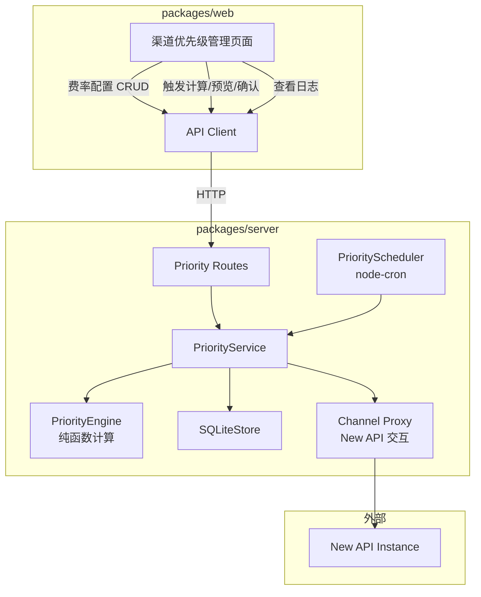
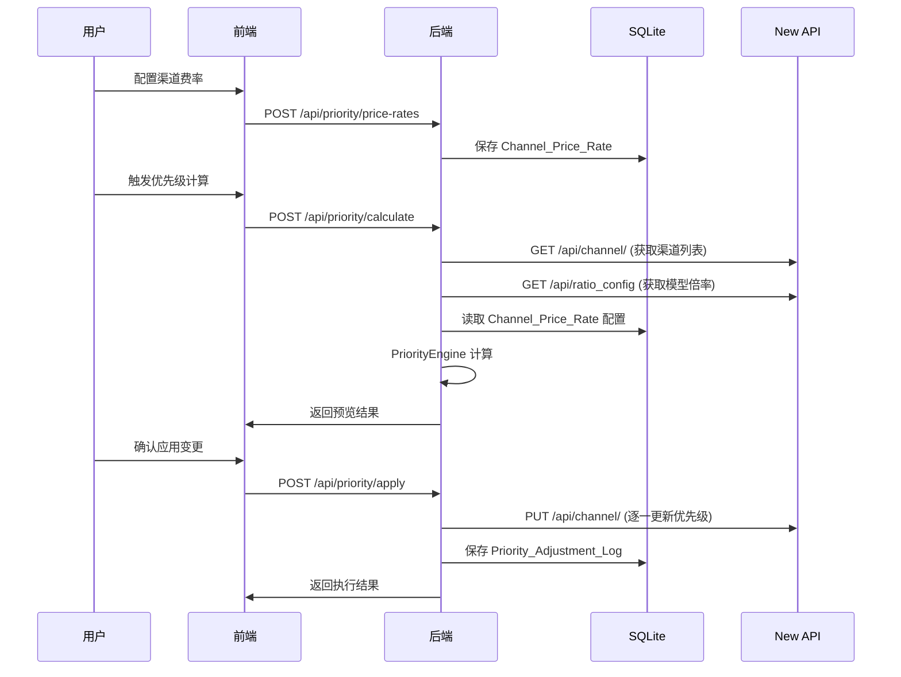

# 设计文档：自动化渠道优先级调配

## 概述

本功能在现有价格同步工具（Sync_Tool）基础上，新增渠道优先级自动调配能力。核心思路是：管理员为每个渠道配置实际充值汇率（Channel_Price_Rate），系统据此计算综合单位成本（Effective_Unit_Cost = Model_Ratio × (1 / Channel_Price_Rate)），按成本从低到高自动分配渠道优先级值，使最便宜的渠道获得最高优先级。

功能涵盖：费率配置与持久化、优先级自动计算引擎、预览确认与自动模式、调整日志、规则配置、定时调配、以及前端页面集成。

### 设计决策

1. **优先级计算为纯函数**：核心计算逻辑（分组、排序、分配优先级值）设计为无副作用的纯函数，便于测试和复用。
2. **复用现有架构模式**：遵循项目已有的 Service + Route + SQLiteStore 分层模式，新增 `priorityService.ts`、`priorityScheduler.ts` 和对应路由。
3. **按 Model_Group 维度计算**：同一模型在多个渠道上的优先级独立计算，不同模型之间互不影响。最终每个渠道取其所有模型组中计算出的最高优先级值。
4. **渠道级别汇总策略**：一个渠道可能支持多个模型，每个模型组可能算出不同的优先级值。最终写入 New API 的是该渠道在所有模型组中获得的最高优先级值（取最优排名）。

## 架构

### 系统架构图



### 数据流




## 组件与接口

### 1. PriorityEngine（纯函数计算引擎）

文件：`packages/server/src/services/priorityEngine.ts`

负责核心优先级计算逻辑，所有函数均为纯函数，无副作用。

```typescript
/** 计算单个渠道在某模型上的综合单位成本 */
function calculateEffectiveUnitCost(modelRatio: number, channelPriceRate: number): number;

/** 按模型分组渠道，返回 Model_Group 映射 */
function groupChannelsByModel(
  channels: Channel[],
  priceRates: Map<number, number>,  // channelId -> priceRate
): Map<string, ModelGroupEntry[]>;

/** 对单个 Model_Group 内的渠道按 Effective_Unit_Cost 排序并分配优先级值 */
function assignPrioritiesForGroup(
  group: ModelGroupEntry[],
  rule: PriorityRule,
): PriorityAssignment[];

/** 汇总所有模型组的结果，为每个渠道取最高优先级值 */
function aggregateChannelPriorities(
  allAssignments: Map<string, PriorityAssignment[]>,
): ChannelPriorityResult[];

/** 完整计算流程：分组 → 排序 → 分配 → 汇总 */
function calculatePriorities(
  channels: Channel[],
  ratioConfig: RatioConfig,
  priceRates: Map<number, number>,
  rule: PriorityRule,
): PriorityCalculationResult;
```

### 2. PriorityService（业务服务层）

文件：`packages/server/src/services/priorityService.ts`

协调 PriorityEngine、SQLiteStore 和 New API 交互。

```typescript
class PriorityService {
  constructor(store: SQLiteStore);

  /** 获取所有渠道费率配置 */
  getPriceRates(): ChannelPriceRateConfig[];

  /** 设置/更新渠道费率 */
  setPriceRate(channelId: number, rate: number): void;

  /** 删除渠道费率 */
  deletePriceRate(channelId: number): void;

  /** 执行优先级计算，返回预览结果 */
  calculate(connection: ConnectionSettings): Promise<PriorityCalculationResult>;

  /** 应用优先级变更到 New API */
  apply(connection: ConnectionSettings, changes: ChannelPriorityResult[]): Promise<ApplyResult>;

  /** 获取/设置优先级规则 */
  getRule(): PriorityRule;
  setRule(rule: PriorityRule): void;

  /** 获取/设置自动模式状态 */
  getAutoMode(): boolean;
  setAutoMode(enabled: boolean): void;

  /** 获取/设置定时调配配置 */
  getScheduleConfig(): ScheduleConfig;
  setScheduleConfig(config: ScheduleConfig): void;

  /** 获取调整日志 */
  getLogs(limit?: number): PriorityAdjustmentLog[];
}
```

### 3. PriorityScheduler（定时调度器）

文件：`packages/server/src/services/priorityScheduler.ts`

遵循现有 `CheckinScheduler` / `LivenessScheduler` 的模式。

```typescript
class PriorityScheduler {
  constructor(priorityService: PriorityService, store: SQLiteStore);

  /** 启动定时任务 */
  start(): void;

  /** 刷新定时任务（配置变更后调用） */
  refresh(): void;

  /** 停止所有定时任务 */
  stop(): void;

  /** 获取调度状态（上次执行时间、下次计划时间） */
  getStatus(): SchedulerStatus;
}
```

### 4. Priority Routes（API 路由）

文件：`packages/server/src/routes/priority.ts`

挂载路径：`/api/priority`

| 方法 | 路径 | 说明 |
|------|------|------|
| GET | `/price-rates` | 获取所有渠道费率配置 |
| PUT | `/price-rates/:channelId` | 设置/更新渠道费率 |
| DELETE | `/price-rates/:channelId` | 删除渠道费率 |
| POST | `/calculate` | 触发优先级计算，返回预览 |
| POST | `/apply` | 确认应用优先级变更 |
| GET | `/rule` | 获取优先级规则 |
| PUT | `/rule` | 更新优先级规则 |
| GET | `/auto-mode` | 获取自动模式状态 |
| PUT | `/auto-mode` | 设置自动模式状态 |
| GET | `/schedule` | 获取定时调配配置 |
| PUT | `/schedule` | 更新定时调配配置 |
| GET | `/schedule/status` | 获取定时任务状态 |
| GET | `/logs` | 获取调整日志列表 |
| GET | `/logs/:id` | 获取单条日志详情 |

### 5. 前端组件

文件：`packages/web/src/pages/ChannelPriority.tsx`

单页面集成所有功能，使用 Ant Design Tabs 组织：

- **费率配置 Tab**：渠道列表 + 费率编辑（内联编辑）
- **优先级计算 Tab**：触发计算按钮 + 预览表格 + 确认/取消 + Auto_Mode 开关
- **渠道对比 Tab**：按模型维度展示多渠道成本对比
- **规则与调度 Tab**：优先级规则配置 + 定时调配配置 + 调度状态
- **调整日志 Tab**：日志列表 + 展开详情

### 6. 前端 API Client 扩展

文件：`packages/web/src/api/client.ts`（扩展现有文件）

新增与 Priority Routes 对应的 API 调用函数。


## 数据模型

### 新增 SQLite 表

#### channel_price_rates（渠道费率配置）

```sql
CREATE TABLE IF NOT EXISTS channel_price_rates (
  id INTEGER PRIMARY KEY AUTOINCREMENT,
  channel_id INTEGER NOT NULL UNIQUE,
  channel_name TEXT NOT NULL,
  price_rate REAL NOT NULL CHECK (price_rate > 0),
  created_at TEXT NOT NULL,
  updated_at TEXT NOT NULL
);
```

#### priority_rules（优先级规则配置）

```sql
CREATE TABLE IF NOT EXISTS priority_rules (
  id INTEGER PRIMARY KEY CHECK (id = 1),
  start_value INTEGER NOT NULL DEFAULT 100,
  step INTEGER NOT NULL DEFAULT 10,
  updated_at TEXT NOT NULL
);
```

#### priority_settings（优先级全局设置）

```sql
CREATE TABLE IF NOT EXISTS priority_settings (
  key TEXT PRIMARY KEY,
  value TEXT NOT NULL,
  updated_at TEXT NOT NULL
);
```

存储键值对：
- `auto_mode`: `"true"` / `"false"`
- `schedule_enabled`: `"true"` / `"false"`
- `schedule_frequency`: `"1h"` / `"6h"` / `"12h"` / `"24h"`

#### priority_adjustment_logs（优先级调整日志）

```sql
CREATE TABLE IF NOT EXISTS priority_adjustment_logs (
  id INTEGER PRIMARY KEY AUTOINCREMENT,
  adjusted_at TEXT NOT NULL,
  trigger_type TEXT NOT NULL,  -- 'manual' | 'scheduled'
  has_changes INTEGER NOT NULL DEFAULT 0,
  details_json TEXT NOT NULL
);
```

### 新增 TypeScript 类型

文件：`packages/shared/types.ts`（扩展现有文件）

```typescript
/** 渠道费率配置 */
export interface ChannelPriceRateConfig {
  channelId: number;
  channelName: string;
  priceRate: number;       // 1 元 = X 美金
  createdAt: string;
  updatedAt: string;
}

/** 优先级规则 */
export interface PriorityRule {
  startValue: number;      // 默认 100
  step: number;            // 默认 10
}

/** 模型组中的单个渠道条目 */
export interface ModelGroupEntry {
  channelId: number;
  channelName: string;
  modelId: string;
  modelRatio: number;
  priceRate: number;
  effectiveUnitCost: number;
  currentPriority: number;
}

/** 单个渠道的优先级分配结果 */
export interface PriorityAssignment {
  channelId: number;
  channelName: string;
  modelId: string;
  effectiveUnitCost: number;
  assignedPriority: number;
}

/** 汇总后的渠道优先级结果 */
export interface ChannelPriorityResult {
  channelId: number;
  channelName: string;
  oldPriority: number;
  newPriority: number;
  priceRate: number;
  modelDetails: {
    modelId: string;
    modelRatio: number;
    effectiveUnitCost: number;
    assignedPriority: number;
  }[];
  changed: boolean;        // newPriority !== oldPriority
}

/** 完整计算结果 */
export interface PriorityCalculationResult {
  channels: ChannelPriorityResult[];
  totalChannels: number;
  changedChannels: number;
  skippedChannels: number;  // 未配置费率的渠道数
  calculatedAt: string;
}

/** 应用结果 */
export interface ApplyResult {
  success: boolean;
  results: {
    channelId: number;
    channelName: string;
    success: boolean;
    error?: string;
  }[];
  totalSuccess: number;
  totalFailed: number;
}

/** 优先级调整日志 */
export interface PriorityAdjustmentLog {
  id: number;
  adjustedAt: string;
  triggerType: 'manual' | 'scheduled';
  hasChanges: boolean;
  details: ChannelPriorityResult[];
}

/** 定时调配配置 */
export interface PriorityScheduleConfig {
  enabled: boolean;
  frequency: '1h' | '6h' | '12h' | '24h';
}

/** 调度器状态 */
export interface SchedulerStatus {
  enabled: boolean;
  frequency: string;
  lastRunAt?: string;
  lastRunResult?: string;
  nextRunAt?: string;
}
```


## 正确性属性（Correctness Properties）

*属性（Property）是指在系统所有合法执行中都应成立的特征或行为——本质上是对系统应做什么的形式化陈述。属性是人类可读规格说明与机器可验证正确性保证之间的桥梁。*

### Property 1: 费率配置持久化往返

*For any* 合法的渠道 ID 和大于 0 的费率值，将其保存到 SQLiteStore 后再读取，应返回与保存时完全相同的渠道 ID 和费率值。对于更新操作，读取结果应反映最新写入的值。

**Validates: Requirements 1.2, 1.3**

### Property 2: 费率删除排除计算

*For any* 渠道集合，若某渠道的费率配置被删除，则该渠道不应出现在优先级计算的分组结果中，且其原有优先级值保持不变。

**Validates: Requirements 1.4, 2.5**

### Property 3: 综合单位成本公式正确性

*For any* 正数 modelRatio 和正数 channelPriceRate，calculateEffectiveUnitCost(modelRatio, channelPriceRate) 应等于 modelRatio × (1 / channelPriceRate)。且在同一模型组内，输出列表应按 Effective_Unit_Cost 升序排列。

**Validates: Requirements 1.7, 2.2**

### Property 4: 模型分组正确性

*For any* 渠道集合和费率配置集合，groupChannelsByModel 的结果应满足：(a) 每个模型组仅包含支持该模型且已配置费率的渠道；(b) 每个已配置费率的渠道-模型对恰好出现在对应模型组中一次；(c) 未配置费率的渠道不出现在任何模型组中。

**Validates: Requirements 2.1**

### Property 5: 优先级分配递减且遵循规则参数

*For any* 优先级规则（startValue, step）和 N 个已排序的渠道，分配的优先级值应为 max(startValue - i × step, 1)（i 从 0 到 N-1）。即第一名获得 startValue，第二名获得 max(startValue - step, 1)，依此类推，最小值不低于 1。

**Validates: Requirements 2.3, 5.3, 5.4**

### Property 6: 等成本渠道保持原有顺序

*For any* 模型组中存在多个 Effective_Unit_Cost 相同的渠道，这些渠道在排序后的相对顺序应与它们原有优先级的降序顺序一致（即原优先级高的排在前面）。

**Validates: Requirements 2.4**

### Property 7: 设置持久化往返

*For any* Auto_Mode 布尔值和 PriorityRule（startValue > 0, step > 0），保存到 SQLiteStore 后再读取，应返回与保存时完全相同的值。

**Validates: Requirements 3.7, 3.10, 5.2**

### Property 8: 应用结果正确分类成功与失败

*For any* 一组渠道优先级更新操作，其中部分成功部分失败，ApplyResult 中的 totalSuccess 应等于 results 中 success 为 true 的数量，totalFailed 应等于 success 为 false 的数量，且 totalSuccess + totalFailed 应等于 results 的总长度。

**Validates: Requirements 3.4**

### Property 9: 调整日志持久化往返

*For any* PriorityAdjustmentLog（包含调整时间、触发类型和详情），保存到 SQLiteStore 后通过 ID 查询，应返回与保存时等价的记录。

**Validates: Requirements 4.1, 6.4**

### Property 10: 日志按时间倒序返回

*For any* 多条 PriorityAdjustmentLog 以不同时间戳保存后，查询日志列表返回的结果应按 adjustedAt 严格降序排列。

**Validates: Requirements 4.2**

### Property 11: 无变更时不执行更新

*For any* 优先级计算结果中所有渠道的 newPriority 等于 oldPriority（即 changedChannels 为 0），定时任务不应发起任何 New API 更新调用。

**Validates: Requirements 6.3**

### Property 12: 最低成本渠道识别

*For any* 模型组中的渠道集合，Effective_Unit_Cost 最小的渠道应被标识为最优渠道。若存在多个渠道具有相同的最低成本，则所有这些渠道都应被标识为最优。

**Validates: Requirements 7.5**


## 错误处理

### 后端错误处理

| 场景 | 处理方式 |
|------|----------|
| Channel_Price_Rate 输入值 ≤ 0 | 返回 400，提示"费率必须大于 0" |
| 渠道 ID 不存在（设置费率时） | 允许设置，因为渠道信息来自 New API，本地仅存储映射 |
| New API 连接失败（获取渠道/倍率） | 返回 502，包含原始错误信息 |
| New API 更新渠道优先级失败 | 记录失败渠道，继续处理其余渠道，最终返回部分成功结果 |
| 优先级规则参数无效（startValue ≤ 0 或 step ≤ 0） | 返回 400，提示参数约束 |
| 定时任务执行异常 | 记录错误日志到 Priority_Adjustment_Log，不中断调度器 |
| SQLite 写入失败 | 抛出 500 错误，由全局错误中间件捕获 |

### 前端错误处理

- 所有 API 调用失败统一通过 Ant Design `message.error()` 展示 Toast 通知
- 网络超时设置为 30 秒，与现有 proxy 调用一致
- 批量更新失败时，展示成功/失败汇总，并提供失败项重试按钮

## 测试策略

### 双重测试方法

本功能采用单元测试与属性测试相结合的策略：

- **单元测试**：验证具体示例、边界条件和错误场景
- **属性测试**：验证跨所有输入的通用属性

两者互补，单元测试捕获具体 bug，属性测试验证通用正确性。

### 属性测试配置

- **库选择**：使用 [fast-check](https://github.com/dubzzz/fast-check) 作为属性测试库（TypeScript 生态最成熟的 PBT 库）
- **运行次数**：每个属性测试最少运行 100 次迭代
- **标签格式**：每个属性测试必须包含注释引用设计文档中的属性编号
  - 格式：`// Feature: auto-channel-priority, Property {number}: {property_text}`
- **每个正确性属性由一个属性测试实现**

### 测试文件规划

| 文件 | 测试类型 | 覆盖范围 |
|------|----------|----------|
| `packages/server/src/services/priorityEngine.test.ts` | 属性测试 + 单元测试 | Property 2-6, 11, 12（纯函数计算逻辑） |
| `packages/server/src/services/priorityStore.test.ts` | 属性测试 + 单元测试 | Property 1, 7, 9, 10（SQLite 持久化） |
| `packages/server/src/services/priorityService.test.ts` | 单元测试 | Property 8（服务层集成，mock New API） |

### 单元测试重点

- Effective_Unit_Cost 计算的具体数值验证（如 modelRatio=2, priceRate=2 → cost=1）
- 空渠道列表、单渠道、全部渠道未配置费率等边界场景
- 优先级值下限钳制（计算值 < 1 时设为 1）
- New API 更新部分失败的错误汇总
- 定时频率到 cron 表达式的映射验证

### 属性测试重点

- 费率 CRUD 往返一致性（Property 1）
- 模型分组的完备性和互斥性（Property 4）
- 优先级分配的递减性和下限约束（Property 5）
- 等成本稳定排序（Property 6）
- 设置持久化往返（Property 7）
- 日志时间排序（Property 10）
