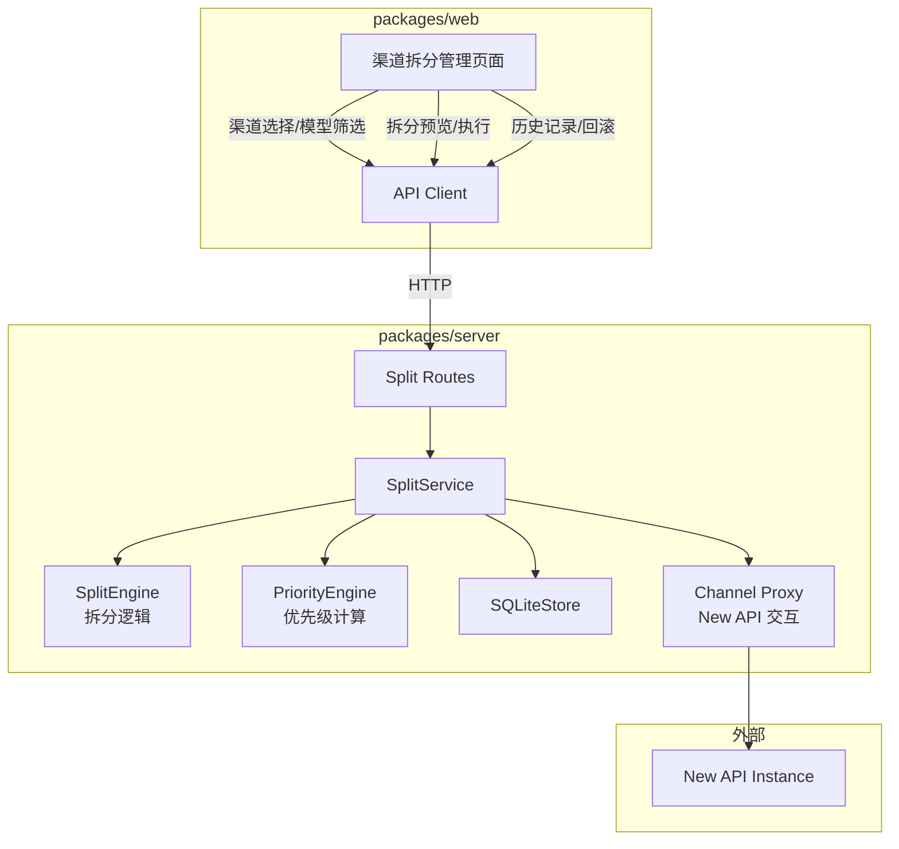
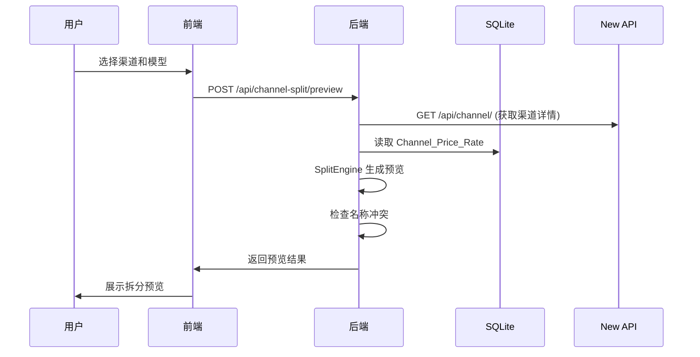
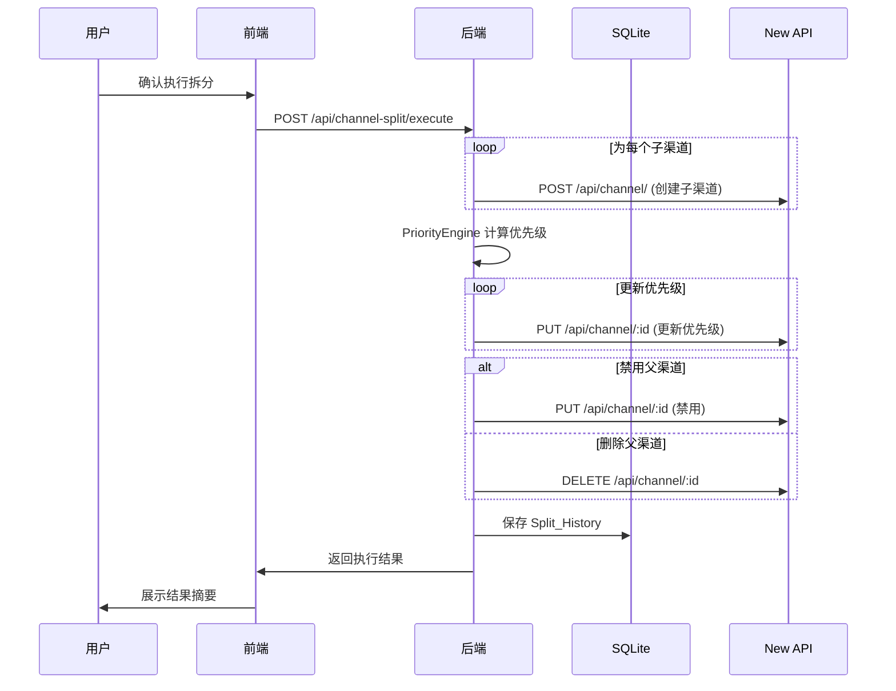

# 设计文档：渠道自动拆分

## 概述

渠道自动拆分功能旨在解决 New API 中无法为不同模型设置不同渠道优先级的核心问题。通过自动将支持多个模型的渠道拆分为多个单模型子渠道，使每个模型可以独立配置渠道优先级，从而实现基于模型的精细化成本优化。

### 核心目标

1. 自动将多模型渠道拆分为单模型子渠道
2. 正确继承父渠道的所有配置参数
3. 基于实际成本自动计算并分配子渠道优先级
4. 提供拆分预览、历史记录和回滚功能
5. 与现有的价格同步和优先级管理功能无缝集成

### 设计决策

1. **拆分粒度**：以模型为单位拆分，每个子渠道仅支持一个模型
2. **命名规则**：使用 `{父渠道名}-拆分-{模型名}` 格式，自动处理名称冲突
3. **配置继承**：子渠道完整继承父渠道的 base_url、key、proxy、config 等所有配置
4. **优先级策略**：基于 Effective_Unit_Cost（Model_Ratio × (1 / Channel_Price_Rate)）自动计算优先级
5. **历史追踪**：记录每次拆分操作的完整信息，支持回滚
6. **批量处理**：支持一次性拆分多个渠道，提高操作效率

## 架构

### 系统架构图



### 数据流

#### 拆分预览流程



#### 拆分执行流程



## 组件与接口

### 1. SplitEngine（拆分逻辑引擎）

文件：`packages/server/src/services/splitEngine.ts`

负责核心拆分逻辑，所有函数均为纯函数。

```typescript
/** 生成子渠道名称，自动处理冲突 */
function generateSubChannelName(
  parentName: string,
  modelId: string,
  existingNames: Set<string>
): string;

/** 从父渠道配置生成子渠道配置 */
function createSubChannelConfig(
  parentChannel: Channel,
  modelId: string,
  subChannelName: string
): Omit<Channel, 'id'>;

/** 生成拆分预览 */
function generateSplitPreview(
  parentChannels: Channel[],
  modelFilters: Map<number, string[]>,
  existingChannels: Channel[]
): SplitPreview;

/** 验证拆分配置 */
function validateSplitConfig(preview: SplitPreview): ValidationResult;
```

### 2. SplitService（业务服务层）

文件：`packages/server/src/services/splitService.ts`

协调 SplitEngine、PriorityEngine、SQLiteStore 和 New API 交互。

```typescript
class SplitService {
  constructor(store: SQLiteStore);

  /** 生成拆分预览 */
  async preview(
    connection: ConnectionSettings,
    channelIds: number[],
    modelFilters?: Map<number, string[]>
  ): Promise<SplitPreview>;

  /** 执行拆分操作 */
  async execute(
    connection: ConnectionSettings,
    preview: SplitPreview,
    options: SplitExecutionOptions
  ): Promise<SplitExecutionResult>;

  /** 获取拆分历史 */
  getSplitHistory(options?: { limit?: number; parentChannelId?: number }): SplitHistoryEntry[];

  /** 回滚拆分操作 */
  async rollback(
    connection: ConnectionSettings,
    historyId: number
  ): Promise<RollbackResult>;

  /** 获取智能拆分建议 */
  async getSplitSuggestions(
    connection: ConnectionSettings
  ): Promise<SplitSuggestion[]>;

  /** 保存/获取拆分配置 */
  saveSplitConfig(config: SplitConfiguration): SplitConfiguration;
  getSplitConfigs(): SplitConfiguration[];
  deleteSplitConfig(id: number): void;
}
```

### 3. Split Routes（API 路由）

文件：`packages/server/src/routes/channelSplit.ts`

挂载路径：`/api/channel-split`

| 方法 | 路径 | 说明 |
|------|------|------|
| POST | `/preview` | 生成拆分预览 |
| POST | `/execute` | 执行拆分操作 |
| GET | `/history` | 获取拆分历史列表 |
| GET | `/history/:id` | 获取单条历史详情 |
| POST | `/rollback/:id` | 回滚拆分操作 |
| GET | `/suggestions` | 获取智能拆分建议 |
| GET | `/configs` | 获取拆分配置列表 |
| POST | `/configs` | 保存拆分配置 |
| DELETE | `/configs/:id` | 删除拆分配置 |

### 4. 前端组件

文件：`packages/web/src/pages/ChannelSplit.tsx`

单页面集成所有功能，使用 Ant Design Tabs 组织：

- **渠道选择 Tab**：渠道列表 + 多选 + 模型筛选器
- **拆分预览 Tab**：预览表格 + 配置验证 + 父渠道处理选项
- **执行结果 Tab**：进度显示 + 结果摘要 + 失败项重试
- **拆分历史 Tab**：历史记录列表 + 详情展开 + 回滚操作
- **智能建议 Tab**：建议列表 + 成本节省分析 + 一键应用
- **配置管理 Tab**：配置列表 + 创建/编辑/删除

### 5. 前端 API Client 扩展

文件：`packages/web/src/api/client.ts`（扩展现有文件）

新增与 Split Routes 对应的 API 调用函数。

### 6. 模型分组管理组件

文件：`packages/web/src/pages/ModelGroupManagement.tsx`

提供按模型分组的渠道管理界面：

- **分组列表视图**：展示所有模型及其支持的渠道数量
- **分组详情视图**：展示某个模型在所有渠道中的配置
- **批量操作**：批量调整优先级、批量删除渠道
- **统计信息**：渠道总数、拆分渠道数、平均优先级、最低成本渠道
- **筛选功能**：按提供商、渠道类型、是否为拆分渠道筛选

## 数据模型

### 新增 SQLite 表

#### channel_split_history（拆分历史记录）

```sql
CREATE TABLE IF NOT EXISTS channel_split_history (
  id INTEGER PRIMARY KEY AUTOINCREMENT,
  split_at TEXT NOT NULL,
  operator TEXT,
  parent_channel_id INTEGER NOT NULL,
  parent_channel_name TEXT NOT NULL,
  parent_channel_config_json TEXT NOT NULL,
  sub_channel_ids_json TEXT NOT NULL,
  model_filter_json TEXT,
  parent_action TEXT NOT NULL,
  auto_priority_enabled INTEGER NOT NULL DEFAULT 0,
  rollback_at TEXT,
  rollback_status TEXT
);

CREATE INDEX IF NOT EXISTS idx_split_history_parent 
  ON channel_split_history(parent_channel_id);

CREATE INDEX IF NOT EXISTS idx_split_history_time 
  ON channel_split_history(split_at DESC);
```

#### split_configurations（拆分配置）

```sql
CREATE TABLE IF NOT EXISTS split_configurations (
  id INTEGER PRIMARY KEY AUTOINCREMENT,
  name TEXT NOT NULL UNIQUE,
  description TEXT,
  model_filter_json TEXT,
  naming_pattern TEXT NOT NULL DEFAULT '{parent}-拆分-{model}',
  parent_action TEXT NOT NULL DEFAULT 'disable',
  auto_priority INTEGER NOT NULL DEFAULT 1,
  created_at TEXT NOT NULL,
  updated_at TEXT NOT NULL
);
```

### 新增 TypeScript 类型

文件：`packages/shared/types.ts`（扩展现有文件）

```typescript
/** 父渠道处理方式 */
export type ParentChannelAction = 'disable' | 'keep' | 'delete';

/** 子渠道预览信息 */
export interface SubChannelPreview {
  name: string;
  modelId: string;
  parentChannelId: number;
  parentChannelName: string;
  config: Omit<Channel, 'id'>;
  suggestedPriority?: number;
  nameConflict: boolean;
  originalName?: string;
}

/** 拆分预览结果 */
export interface SplitPreview {
  parentChannels: {
    id: number;
    name: string;
    modelCount: number;
    subChannelCount: number;
  }[];
  subChannels: SubChannelPreview[];
  totalSubChannels: number;
  nameConflicts: number;
  validationErrors: string[];
}

/** 拆分执行选项 */
export interface SplitExecutionOptions {
  parentAction: ParentChannelAction;
  autoPriority: boolean;
  operator?: string;
}

/** 拆分执行结果 */
export interface SplitExecutionResult {
  success: boolean;
  createdSubChannels: {
    id: number;
    name: string;
    modelId: string;
    success: boolean;
    error?: string;
  }[];
  priorityUpdateResults?: {
    channelId: number;
    success: boolean;
    error?: string;
  }[];
  parentChannelResults: {
    channelId: number;
    action: ParentChannelAction;
    success: boolean;
    error?: string;
  }[];
  totalSuccess: number;
  totalFailed: number;
  historyId: number;
}

/** 拆分历史条目 */
export interface SplitHistoryEntry {
  id: number;
  splitAt: string;
  operator?: string;
  parentChannelId: number;
  parentChannelName: string;
  parentChannelConfig: Channel;
  subChannelIds: number[];
  modelFilter?: string[];
  parentAction: ParentChannelAction;
  autoPriorityEnabled: boolean;
  rollbackAt?: string;
  rollbackStatus?: 'success' | 'partial' | 'failed';
}

/** 回滚结果 */
export interface RollbackResult {
  success: boolean;
  deletedSubChannels: {
    id: number;
    name: string;
    success: boolean;
    error?: string;
  }[];
  parentChannelRestored: boolean;
  parentChannelError?: string;
  totalSuccess: number;
  totalFailed: number;
}

/** 智能拆分建议 */
export interface SplitSuggestion {
  channelId: number;
  channelName: string;
  modelCount: number;
  suggestedModels: string[];
  estimatedCostSaving: number;
  reason: string;
  priority: 'high' | 'medium' | 'low';
}

/** 拆分配置 */
export interface SplitConfiguration {
  id?: number;
  name: string;
  description?: string;
  modelFilter?: string[];
  namingPattern: string;
  parentAction: ParentChannelAction;
  autoPriority: boolean;
  createdAt: string;
  updatedAt: string;
}

/** 模型分组信息 */
export interface ModelGroupInfo {
  modelId: string;
  channelCount: number;
  splitChannelCount: number;
  channels: {
    id: number;
    name: string;
    priority: number;
    isSplitChannel: boolean;
    parentChannelId?: number;
    parentChannelName?: string;
    priceRate?: number;
    effectiveUnitCost?: number;
  }[];
  averagePriority: number;
  lowestCostChannelId?: number;
}

/** 批量删除结果 */
export interface BatchDeleteResult {
  success: boolean;
  deletedChannels: {
    id: number;
    name: string;
    success: boolean;
    error?: string;
  }[];
  totalSuccess: number;
  totalFailed: number;
}

/** 批量优先级更新结果 */
export interface BatchPriorityUpdateResult {
  success: boolean;
  updatedChannels: {
    id: number;
    name: string;
    oldPriority: number;
    newPriority: number;
    success: boolean;
    error?: string;
  }[];
  totalSuccess: number;
  totalFailed: number;
}
```


## 正确性属性（Correctness Properties）

*属性（Property）是指在系统所有合法执行中都应成立的特征或行为——本质上是对系统应做什么的形式化陈述。属性是人类可读规格说明与机器可验证正确性保证之间的桥梁。*

### Property 1: 子渠道名称唯一性与冲突解决

*For any* 拆分操作生成的子渠道名称集合和现有渠道名称集合，生成的名称集合中不应存在重复，且通过添加数字后缀（-2、-3 等）解决冲突后，所有名称都不应与现有渠道名称冲突。

**Validates: Requirements 2.3, 2.4, 2.5, 12.6**

### Property 2: 配置继承完整性

*For any* 父渠道和从其生成的子渠道，子渠道应继承父渠道的 base_url、key、type、proxy、config、group、test_model 等所有配置字段，且 model_mapping 应仅包含该子渠道模型的映射规则（如果存在）。

**Validates: Requirements 3.2, 3.4, 3.5**

### Property 3: 模型字段单一性

*For any* 生成的子渠道，其 models 字段应仅包含一个模型 ID，且该模型 ID 应来自父渠道的 models 列表。

**Validates: Requirements 3.3**

### Property 4: 模型筛选器正确性

*For any* 指定了模型筛选器的拆分操作，生成的子渠道集合应仅包含筛选器中指定的模型；如果未指定筛选器，则应包含父渠道的所有模型。

**Validates: Requirements 1.4, 1.5**

### Property 5: 拆分预览与执行一致性

*For any* 拆分预览结果，如果用户不修改预览内容直接执行，则实际创建的子渠道数量、名称和配置应与预览中显示的完全一致。

**Validates: Requirements 2.1, 2.2, 2.7**

### Property 6: 优先级计算单调性

*For any* 模型组中的子渠道集合，当所有子渠道都配置了 Channel_Price_Rate 时，按 Effective_Unit_Cost 排序后，分配的优先级值应严格递减（成本越低优先级值越高）。

**Validates: Requirements 4.3, 4.4, 4.5, 4.6**

### Property 7: 优先级计算公式正确性

*For any* 正数 Model_Ratio 和正数 Channel_Price_Rate，计算的 Effective_Unit_Cost 应等于 Model_Ratio × (1 / Channel_Price_Rate)。

**Validates: Requirements 4.3**

### Property 8: 初始优先级继承

*For any* 子渠道，如果未启用自动优先级分配或缺少 Channel_Price_Rate 配置，其初始优先级应等于父渠道的优先级值。

**Validates: Requirements 3.6, 4.7**

### Property 9: 拆分历史持久化往返

*For any* 拆分操作完成后保存的历史记录，从数据库读取该记录应返回与保存时完全相同的父渠道 ID、父渠道名称、子渠道 ID 列表、模型筛选器、父渠道处理方式和自动优先级启用状态。

**Validates: Requirements 6.1, 6.2**

### Property 10: 拆分历史时间排序

*For any* 查询拆分历史的操作，返回的结果应按 split_at 时间戳严格降序排列（最新的在前）。

**Validates: Requirements 6.3**

### Property 11: 回滚操作逆向性

*For any* 拆分历史记录，执行回滚操作应删除该次拆分创建的所有子渠道；如果父渠道在拆分时被禁用，回滚应重新启用父渠道；回滚完成后应更新历史记录的回滚状态。

**Validates: Requirements 7.3, 7.4, 7.7**

### Property 12: 批量拆分独立性

*For any* 批量拆分操作中的多个父渠道，每个父渠道的拆分结果应独立，一个渠道的拆分失败不应影响其他渠道的拆分执行。

**Validates: Requirements 8.6**

### Property 13: 父渠道处理正确性

*For any* 父渠道处理操作，选择"禁用"应将父渠道 status 设置为禁用状态，选择"保留"应保持父渠道所有配置不变，选择"删除"应删除父渠道。

**Validates: Requirements 5.2, 5.3, 5.4**

### Property 14: 拆分配置持久化往返

*For any* 保存的拆分配置，从数据库读取该配置应返回与保存时完全相同的名称、描述、模型筛选器、命名模式、父渠道处理方式和自动优先级启用状态。

**Validates: Requirements 9.1, 9.2, 9.3**

### Property 15: 单模型渠道拒绝拆分

*For any* 仅包含一个模型的渠道，系统应拒绝对其执行拆分操作，并返回明确的错误提示。

**Validates: Requirements 1.7, 12.1**

### Property 16: 智能建议成本排序

*For any* 智能拆分建议列表，建议应按预计成本节省百分比从高到低排序，且价格差异超过 20% 的模型应被标识为高优先级。

**Validates: Requirements 10.3, 10.8**

### Property 17: 模型分组完整性

*For any* 模型分组视图中的模型组，该组应包含所有支持该模型的渠道（包括拆分子渠道和普通渠道），且每个渠道恰好出现在一个模型组中。

**Validates: Requirements 14.1, 14.2**

### Property 18: 批量删除原子性

*For any* 批量删除操作，每个渠道的删除应独立执行，一个渠道删除失败不应影响其他渠道的删除；且删除操作应同时删除 New_API_Instance 中的渠道和本地 Split_History 中的记录。

**Validates: Requirements 14.5, 14.6, 14.7, 14.12**

### Property 19: 批量优先级更新一致性

*For any* 批量优先级更新操作，所有成功更新的渠道在 New_API_Instance 中的优先级值应与请求的优先级值完全一致。

**Validates: Requirements 14.10**

## 错误处理

### 后端错误处理

| 场景 | 处理方式 |
|------|----------|
| 渠道 ID 不存在 | 返回 404，提示"渠道不存在" |
| 单模型渠道拆分 | 返回 400，提示"该渠道仅包含一个模型，无需拆分" |
| 名称冲突无法解决 | 返回 400，提示"无法生成唯一的子渠道名称" |
| New API 连接失败 | 返回 502，包含原始错误信息 |
| 子渠道创建失败 | 记录失败项，继续创建其他子渠道，最终返回部分成功结果 |
| 优先级更新失败 | 记录失败项，不影响已创建的子渠道 |
| 父渠道处理失败 | 记录错误，不影响已创建的子渠道 |
| 拆分历史不存在 | 返回 404，提示"拆分历史记录不存在" |
| 回滚操作部分失败 | 返回部分成功结果，标识哪些子渠道删除失败 |
| SQLite 写入失败 | 抛出 500 错误，由全局错误中间件捕获 |

### 前端错误处理

- 所有 API 调用失败统一通过 Ant Design `message.error()` 展示 Toast 通知
- 网络超时设置为 60 秒（拆分操作可能耗时较长）
- 批量拆分失败时，展示成功/失败汇总，并提供失败项重试按钮
- 回滚操作前显示二次确认对话框
- 删除父渠道前显示警告对话框

### 降级策略

当拆分功能部分不可用时：

1. 如果无法获取 Channel_Price_Rate，禁用自动优先级功能，但允许手动拆分
2. 如果无法保存拆分历史，记录警告但不阻止拆分操作
3. 如果智能建议功能失败，隐藏建议 Tab，不影响手动拆分
4. 如果配置管理功能失败，使用默认配置，不影响核心拆分功能

## 测试策略

### 双重测试方法

本功能采用单元测试与属性测试相结合的策略：

- **单元测试**：验证具体示例、边界条件和错误场景
- **属性测试**：验证跨所有输入的通用属性

两者互补，单元测试捕获具体 bug，属性测试验证通用正确性。

### 属性测试配置

- **库选择**：使用 [fast-check](https://github.com/dubzzz/fast-check) 作为属性测试库
- **运行次数**：每个属性测试最少运行 100 次迭代
- **标签格式**：每个属性测试必须包含注释引用设计文档中的属性编号
  - 格式：`// Feature: channel-auto-split, Property {number}: {property_text}`
- **每个正确性属性由一个属性测试实现**

### 测试文件规划

| 文件 | 测试类型 | 覆盖范围 |
|------|----------|----------|
| `packages/server/src/services/splitEngine.test.ts` | 属性测试 + 单元测试 | Property 1, 2, 3, 4, 5, 15（纯函数拆分逻辑） |
| `packages/server/src/services/splitStore.test.ts` | 属性测试 + 单元测试 | Property 9, 10, 14（SQLite 持久化） |
| `packages/server/src/services/splitService.test.ts` | 单元测试 | Property 11, 12, 13（服务层集成，mock New API） |
| `packages/server/src/services/priorityEngine.test.ts` | 属性测试 | Property 6, 7, 8（优先级计算逻辑） |
| `packages/server/src/services/suggestionEngine.test.ts` | 属性测试 + 单元测试 | Property 16（智能建议逻辑） |

### 单元测试重点

- 子渠道名称生成的具体示例（如 "渠道A-拆分-gpt-4"）
- 名称冲突处理（如 "渠道A-拆分-gpt-4-2"）
- 空渠道列表、单模型渠道等边界场景
- 配置继承的完整性验证（所有字段都正确复制）
- 模型映射规则的正确提取
- 拆分执行部分失败的错误汇总
- 回滚操作的完整性验证
- 批量拆分的进度跟踪

### 属性测试重点

- 子渠道名称唯一性与冲突解决（Property 1）
- 配置继承完整性（Property 2）
- 模型字段单一性（Property 3）
- 模型筛选器正确性（Property 4）
- 拆分预览与执行一致性（Property 5）
- 优先级计算单调性（Property 6）
- 优先级计算公式正确性（Property 7）
- 初始优先级继承（Property 8）
- 拆分历史持久化往返（Property 9）
- 时间排序（Property 10）
- 拆分配置持久化往返（Property 14）
- 单模型渠道拒绝拆分（Property 15）
- 智能建议成本排序（Property 16）

### 集成测试

- 完整的拆分流程：选择渠道 → 预览 → 执行 → 验证结果
- 拆分后优先级自动计算和应用
- 拆分历史记录和回滚操作
- 批量拆分多个渠道
- 智能建议生成和应用
- 与现有优先级管理功能的集成

### 测试覆盖目标

- 拆分引擎：95% 代码覆盖率
- 服务层：90% 代码覆盖率
- API 层：85% 代码覆盖率
- 前端组件：80% 代码覆盖率
- 所有正确性属性：100% 实现

