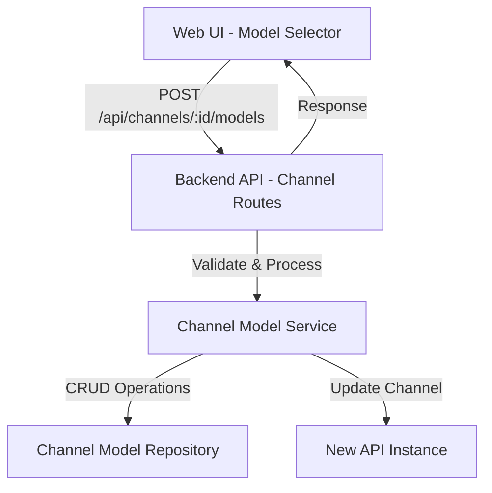

# Design Document: Channel Model Addition

## Overview

This feature enables system administrators to add AI models to existing channels through a user-friendly interface. The design follows a client-server architecture where the web frontend provides model selection capabilities and the backend handles validation, persistence, and transaction management.

The feature integrates with the existing New API channel management system, extending it with multi-select model addition capabilities. It ensures data integrity through validation checks, prevents duplicate associations, and provides clear feedback on operation success or failure.

Key design principles:
- **Atomic operations**: All model additions within a single request succeed or fail together
- **Validation-first**: Comprehensive validation before any database modifications
- **User feedback**: Clear, immediate feedback on all operations
- **Concurrent safety**: Transaction isolation to handle simultaneous operations

## Architecture

### System Components



### Component Responsibilities

**Web UI (Model Selector)**
- Display available models filtered by channel
- Handle multi-select interactions
- Submit selected models to backend
- Display operation feedback
- Refresh channel display after successful operations

**Backend API (Channel Routes)**
- Receive and validate HTTP requests
- Coordinate between service layer and New API
- Handle error responses
- Return structured responses

**Channel Model Service**
- Business logic for model addition
- Validation of channels and models
- Transaction management
- Duplicate detection
- Retry logic for concurrent conflicts

**Channel Model Repository**
- Direct interaction with New API endpoints
- Fetch channel details
- Update channel model lists
- Handle API communication errors

### Data Flow

1. **Model Selection Flow**
   ```
   User opens add model dialog
   → UI fetches channel details
   → UI fetches all available models
   → UI filters out already-associated models
   → User selects models
   → User submits
   ```

2. **Model Addition Flow**
   ```
   UI sends POST request with model IDs
   → Backend validates channel exists
   → Backend validates all models exist
   → Backend checks for duplicates
   → Backend updates channel.models field
   → Backend sends update to New API
   → Backend returns success/error
   → UI displays feedback and refreshes
   ```

## Components and Interfaces

### Frontend Components

#### ModelSelectorModal Component

```typescript
interface ModelSelectorModalProps {
  visible: boolean;
  channelId: number;
  channelName: string;
  currentModels: string[];
  onClose: () => void;
  onSuccess: () => void;
}
```

**Responsibilities:**
- Display modal dialog for model selection
- Fetch and display available models
- Handle multi-select state
- Submit selected models
- Display loading and error states

**Key Methods:**
- `fetchAvailableModels()`: Retrieve models not in channel
- `handleModelSelect(modelId: string)`: Toggle model selection
- `handleSubmit()`: Send selected models to backend
- `handleClose()`: Close modal and reset state

#### ModelSelectionList Component

```typescript
interface ModelSelectionListProps {
  models: ModelInfo[];
  selectedModelIds: Set<string>;
  onToggle: (modelId: string) => void;
  loading: boolean;
}
```

**Responsibilities:**
- Render list of selectable models
- Display model metadata (name, provider, description)
- Handle checkbox interactions
- Show loading states

### Backend Components

#### Channel Routes Extension

```typescript
// New endpoint
router.post('/api/channels/:id/models', async (req, res) => {
  const { id } = req.params;
  const { modelIds } = req.body;
  const { targetUrl, apiKey, userId } = req.body.connection;
  
  // Delegate to service layer
  const result = await addModelsToChannel(
    targetUrl,
    apiKey,
    userId,
    parseInt(id),
    modelIds
  );
  
  res.json(result);
});
```

#### Channel Model Service

```typescript
interface AddModelsResult {
  success: boolean;
  addedCount: number;
  errors?: string[];
}

async function addModelsToChannel(
  targetUrl: string,
  apiKey: string,
  userId: string | undefined,
  channelId: number,
  modelIds: string[]
): Promise<AddModelsResult>
```

**Key Functions:**

1. **validateChannelExists**: Verify channel exists in New API
2. **validateModelsExist**: Verify all models are valid
3. **checkDuplicates**: Detect already-associated models
4. **updateChannelModels**: Perform the actual update with retry logic
5. **parseAndMergeModels**: Merge new models with existing ones

### API Contracts

#### Add Models to Channel

**Request:**
```typescript
POST /api/channels/:id/models

{
  "modelIds": ["gpt-4o", "claude-3-opus"],
  "connection": {
    "targetUrl": "https://api.example.com",
    "apiKey": "sk-...",
    "userId": "user123"
  }
}
```

**Success Response:**
```typescript
{
  "success": true,
  "addedCount": 2,
  "message": "Successfully added 2 models to channel"
}
```

**Error Response:**
```typescript
{
  "success": false,
  "error": "Duplicate models detected: gpt-4o",
  "errors": ["gpt-4o already associated with channel"]
}
```

#### Get Available Models for Channel

**Request:**
```typescript
GET /api/channels/:id/available-models?targetUrl=...&apiKey=...&userId=...
```

**Response:**
```typescript
{
  "success": true,
  "models": [
    {
      "modelId": "gpt-4o",
      "modelName": "GPT-4 Optimized",
      "provider": "OpenAI",
      "description": "Latest GPT-4 model"
    }
  ]
}
```

## Data Models

### Channel Model (Existing)

```typescript
interface Channel {
  id: number;
  name: string;
  type: number;
  key?: string;
  base_url?: string;
  models: string;              // Comma-separated model IDs
  model_mapping: string;       // JSON string of mappings
  status: number;
  priority: number;
}
```

**Key Fields:**
- `models`: Comma-separated string of model IDs (e.g., "gpt-4o,claude-3-opus")
- `model_mapping`: JSON string for model name mappings (e.g., '{"internal-name": "standard-name"}')

### Model Info

```typescript
interface ModelInfo {
  modelId: string;
  modelName: string;
  provider: string;
  description?: string;
}
```

### Add Models Request

```typescript
interface AddModelsRequest {
  modelIds: string[];
  connection: {
    targetUrl: string;
    apiKey: string;
    userId?: string;
  };
}
```

### Add Models Response

```typescript
interface AddModelsResponse {
  success: boolean;
  addedCount?: number;
  message?: string;
  error?: string;
  errors?: string[];
}
```

## Correctness Properties

*A property is a characteristic or behavior that should hold true across all valid executions of a system-essentially, a formal statement about what the system should do. Properties serve as the bridge between human-readable specifications and machine-verifiable correctness guarantees.*


### Property 1: Available Models Exclude Associated Models

*For any* channel with existing model associations, the list of available models for addition should not contain any models already associated with that channel.

**Validates: Requirements 1.3**

### Property 2: Model Display Contains Required Information

*For any* model in the selection list, the rendered display should contain the model's name, identifier, and description.

**Validates: Requirements 1.2**

### Property 3: Multi-Select State Tracking

*For any* sequence of model selections, the selection state should accurately reflect all selected models without duplicates.

**Validates: Requirements 2.1**

### Property 4: Selection Toggle Behavior

*For any* model, selecting it and then deselecting it should result in the model not being in the final selection set.

**Validates: Requirements 2.3**

### Property 5: Submit Disabled When Empty

*For any* UI state where no models are selected, the submit action should be disabled.

**Validates: Requirements 2.4**

### Property 6: Model Addition Round-Trip

*For any* valid channel and set of valid models, after successfully adding the models to the channel, fetching the channel's model list should include all the added models.

**Validates: Requirements 3.1, 3.2**

### Property 7: Success Response Format

*For any* successful model addition operation, the response should indicate success and include the count of models added.

**Validates: Requirements 3.3**

### Property 8: Duplicate Model Rejection

*For any* channel and model, if the model is already associated with the channel, attempting to add it again should be rejected with an error response.

**Validates: Requirements 4.1, 4.2**

### Property 9: Channel Existence Validation

*For any* non-existent channel ID, attempting to add models to it should be rejected with an error indicating the channel does not exist.

**Validates: Requirements 4.3**

### Property 10: Model Existence Validation

*For any* set of model IDs containing at least one non-existent model, the add operation should be rejected with an error identifying the invalid models.

**Validates: Requirements 4.4**

### Property 11: Atomic Validation

*For any* add models request, if any validation check fails (channel existence, model existence, or duplicate detection), no models should be added to the channel and an error should be returned.

**Validates: Requirements 4.5**

### Property 12: Operation Feedback Display

*For any* completed add models operation (success or failure), the UI should display appropriate feedback indicating the outcome and relevant details (count for success, reason for failure).

**Validates: Requirements 5.1, 5.2**

### Property 13: Dialog Closes After Operation

*For any* add models operation that completes (successfully or with error), the model selection dialog should be closed.

**Validates: Requirements 5.4**

### Property 14: Model Count Update

*For any* successful model addition, the displayed model count for the channel should be updated to reflect the new total.

**Validates: Requirements 6.1**

### Property 15: Added Models Appear in List

*For any* successful model addition, viewing the channel's model list should show all the newly added models.

**Validates: Requirements 6.3**

### Property 16: Concurrent Operations Atomicity

*For any* set of concurrent add models requests to the same channel, each operation should complete atomically without data corruption, and all added models should be correctly persisted.

**Validates: Requirements 7.1**

### Property 17: Conflict Retry Behavior

*For any* add models operation that encounters a conflict, the system should retry the operation up to 3 times before failing.

**Validates: Requirements 7.3**

### Property 18: Error After Retry Exhaustion

*For any* add models operation where all retry attempts fail due to conflicts, the system should return an error response indicating a conflict occurred.

**Validates: Requirements 7.4**

### Property 19: Bulk Operation Atomicity

*For any* bulk add models operation, either all models should be successfully added to the channel, or none should be added (no partial additions).

**Validates: Requirements 8.2, 8.3**

## Error Handling

### Validation Errors

**Channel Not Found**
- **Trigger**: Channel ID does not exist in the system
- **Response**: HTTP 404 with error message "Channel not found: {channelId}"
- **User Feedback**: "The selected channel no longer exists. Please refresh and try again."

**Model Not Found**
- **Trigger**: One or more model IDs do not exist
- **Response**: HTTP 400 with error message "Invalid models: {modelIds}"
- **User Feedback**: "Some selected models are no longer available: {modelNames}"

**Duplicate Models**
- **Trigger**: Attempting to add models already associated with the channel
- **Response**: HTTP 409 with error message "Duplicate models: {modelIds}"
- **User Feedback**: "The following models are already in this channel: {modelNames}"

**Empty Selection**
- **Trigger**: Submitting with no models selected
- **Response**: HTTP 400 with error message "No models selected"
- **User Feedback**: "Please select at least one model to add."

### Network Errors

**Connection Timeout**
- **Trigger**: New API instance does not respond within timeout period
- **Response**: HTTP 504 with error message "Request timeout"
- **User Feedback**: "Connection timed out. Please check your network and try again."
- **Retry**: Automatic retry up to 3 times with exponential backoff

**API Unavailable**
- **Trigger**: New API instance returns 5xx error
- **Response**: HTTP 502 with error message "Upstream service unavailable"
- **User Feedback**: "The API service is temporarily unavailable. Please try again later."
- **Retry**: Automatic retry up to 3 times

### Concurrent Operation Errors

**Optimistic Lock Failure**
- **Trigger**: Channel was modified by another operation during processing
- **Response**: HTTP 409 with error message "Channel was modified by another operation"
- **User Feedback**: "This channel was modified by another user. Please refresh and try again."
- **Retry**: Automatic retry up to 3 times

**Transaction Rollback**
- **Trigger**: Partial failure during bulk operation
- **Response**: HTTP 500 with error message "Transaction failed: {reason}"
- **User Feedback**: "Failed to add models. No changes were made. Error: {reason}"
- **Retry**: No automatic retry (user must retry manually)

### Error Recovery Strategies

1. **Automatic Retry**: For transient errors (network, conflicts), retry up to 3 times with exponential backoff (100ms, 200ms, 400ms)

2. **Transaction Rollback**: For bulk operations, ensure all-or-nothing semantics by rolling back on any failure

3. **User Notification**: Always provide clear, actionable error messages to users

4. **Logging**: Log all errors with context (channel ID, model IDs, user ID, timestamp) for debugging

5. **Graceful Degradation**: If model metadata cannot be fetched, show model IDs only rather than failing completely

## Testing Strategy

### Dual Testing Approach

This feature requires both unit tests and property-based tests to ensure comprehensive coverage:

**Unit Tests** focus on:
- Specific examples of model addition scenarios
- Edge cases (empty lists, single model, maximum models)
- Error conditions (invalid IDs, network failures)
- Integration points between UI and backend
- Mock API responses and error handling

**Property-Based Tests** focus on:
- Universal properties that hold for all inputs
- Comprehensive input coverage through randomization
- Validation logic across all possible model/channel combinations
- Concurrent operation safety
- Transaction atomicity

Together, these approaches provide comprehensive coverage where unit tests catch concrete bugs and property tests verify general correctness.

### Property-Based Testing Configuration

**Framework**: fast-check (JavaScript/TypeScript)

**Configuration**:
- Minimum 100 iterations per property test
- Each test tagged with feature name and property number
- Tag format: `Feature: channel-model-addition, Property {number}: {property_text}`

**Test Organization**:
```
tests/
  unit/
    channelModelService.test.ts
    modelSelector.test.ts
    channelRoutes.test.ts
  property/
    channelModelAddition.property.test.ts
```

### Property Test Examples

**Property 6: Model Addition Round-Trip**
```typescript
// Feature: channel-model-addition, Property 6: Model Addition Round-Trip
it('should persist added models (round-trip)', async () => {
  await fc.assert(
    fc.asyncProperty(
      fc.integer({ min: 1, max: 1000 }), // channelId
      fc.array(fc.string({ minLength: 1, maxLength: 50 }), { minLength: 1, maxLength: 10 }), // modelIds
      async (channelId, modelIds) => {
        // Setup: Create channel with no models
        await createTestChannel(channelId, []);
        
        // Action: Add models
        await addModelsToChannel(channelId, modelIds);
        
        // Verify: Fetch channel and check models are present
        const channel = await fetchChannel(channelId);
        const channelModels = channel.models.split(',');
        
        for (const modelId of modelIds) {
          expect(channelModels).toContain(modelId);
        }
      }
    ),
    { numRuns: 100 }
  );
});
```

**Property 8: Duplicate Model Rejection**
```typescript
// Feature: channel-model-addition, Property 8: Duplicate Model Rejection
it('should reject duplicate model additions', async () => {
  await fc.assert(
    fc.asyncProperty(
      fc.integer({ min: 1, max: 1000 }), // channelId
      fc.array(fc.string({ minLength: 1, maxLength: 50 }), { minLength: 1, maxLength: 10 }), // existingModels
      fc.string({ minLength: 1, maxLength: 50 }), // duplicateModel (pick from existing)
      async (channelId, existingModels, _) => {
        if (existingModels.length === 0) return; // Skip if no existing models
        
        const duplicateModel = existingModels[0]; // Use first existing model
        
        // Setup: Create channel with existing models
        await createTestChannel(channelId, existingModels);
        
        // Action: Attempt to add duplicate model
        const result = await addModelsToChannel(channelId, [duplicateModel]);
        
        // Verify: Operation should fail with duplicate error
        expect(result.success).toBe(false);
        expect(result.error).toContain('duplicate');
      }
    ),
    { numRuns: 100 }
  );
});
```

**Property 19: Bulk Operation Atomicity**
```typescript
// Feature: channel-model-addition, Property 19: Bulk Operation Atomicity
it('should add all models or none (atomicity)', async () => {
  await fc.assert(
    fc.asyncProperty(
      fc.integer({ min: 1, max: 1000 }), // channelId
      fc.array(fc.string({ minLength: 1, maxLength: 50 }), { minLength: 2, maxLength: 20 }), // modelIds
      fc.integer({ min: 0, max: 19 }), // indexToMakeInvalid
      async (channelId, modelIds, invalidIndex) => {
        // Setup: Create channel, make one model ID invalid
        await createTestChannel(channelId, []);
        const modelsWithInvalid = [...modelIds];
        modelsWithInvalid[invalidIndex] = 'INVALID_MODEL_ID_' + Math.random();
        
        // Get initial model count
        const initialChannel = await fetchChannel(channelId);
        const initialCount = initialChannel.models ? initialChannel.models.split(',').length : 0;
        
        // Action: Attempt to add models (should fail due to invalid model)
        const result = await addModelsToChannel(channelId, modelsWithInvalid);
        
        // Verify: Operation should fail and no models should be added
        expect(result.success).toBe(false);
        
        const finalChannel = await fetchChannel(channelId);
        const finalCount = finalChannel.models ? finalChannel.models.split(',').length : 0;
        
        expect(finalCount).toBe(initialCount); // No partial additions
      }
    ),
    { numRuns: 100 }
  );
});
```

### Unit Test Coverage

**Channel Model Service Tests**:
- Add single model to empty channel
- Add multiple models to channel with existing models
- Reject duplicate model addition
- Reject invalid channel ID
- Reject invalid model IDs
- Handle network timeout with retry
- Handle concurrent modification with retry
- Rollback on partial failure

**Model Selector Component Tests**:
- Display available models
- Filter out associated models
- Handle model selection/deselection
- Disable submit when no selection
- Display success message after addition
- Display error message on failure
- Close dialog after operation

**API Route Tests**:
- Parse request parameters correctly
- Validate required fields
- Return appropriate HTTP status codes
- Handle service layer errors
- Format response correctly

### Integration Tests

**End-to-End Scenarios**:
1. User opens model selector → sees available models → selects models → submits → sees success message → channel updated
2. User attempts to add duplicate model → sees error message → no changes made
3. Two users add models to same channel concurrently → both operations succeed → all models added
4. User adds 50 models in bulk → all added successfully → channel reflects all additions
5. Network error during addition → automatic retry → eventual success

### Performance Tests

**Load Testing**:
- Add 100 models to a channel (maximum bulk size)
- 10 concurrent users adding models to different channels
- 5 concurrent users adding models to the same channel

**Performance Targets**:
- Single model addition: < 500ms
- Bulk addition (10 models): < 1s
- Bulk addition (50 models): < 2s
- Bulk addition (100 models): < 3s

### Test Data Generation

**Generators for Property Tests**:
```typescript
// Generate valid channel IDs
const channelIdGen = fc.integer({ min: 1, max: 10000 });

// Generate valid model IDs
const modelIdGen = fc.string({ 
  minLength: 3, 
  maxLength: 50,
  pattern: /^[a-z0-9-]+$/
});

// Generate model lists
const modelListGen = fc.array(modelIdGen, { 
  minLength: 1, 
  maxLength: 100 
});

// Generate channels with models
const channelGen = fc.record({
  id: channelIdGen,
  name: fc.string({ minLength: 1, maxLength: 100 }),
  models: fc.array(modelIdGen, { maxLength: 50 }).map(arr => arr.join(',')),
  type: fc.integer({ min: 1, max: 40 }),
  status: fc.constantFrom(0, 1),
  priority: fc.integer({ min: 0, max: 1000 })
});
```

