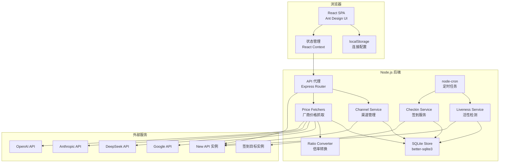
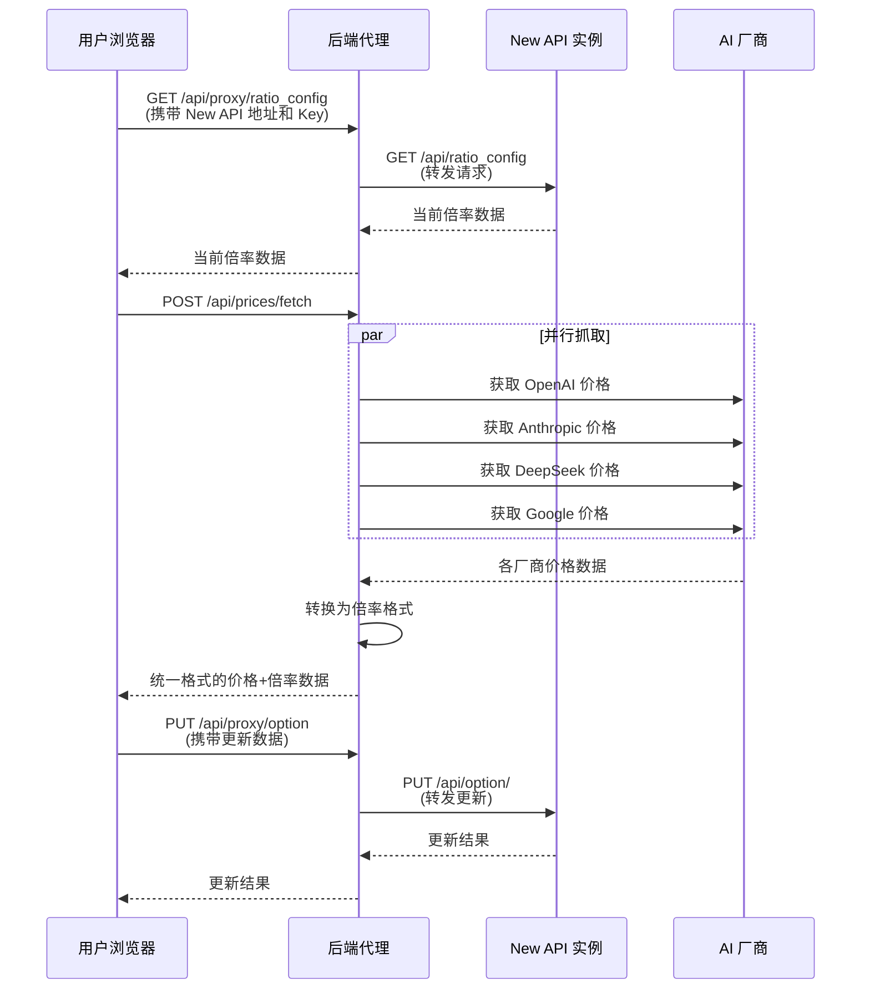

# 设计文档

## 概述

New API 模型价格同步管理工具（Sync_Tool）是一个前后端分离的 Web 应用。前端使用 React + TypeScript + Ant Design 构建交互式管理界面，后端使用 Node.js + Express 提供轻量 API 代理层（解决浏览器跨域限制和厂商价格页面抓取）。

### 核心设计决策

1. **前后端分离架构**：前端 SPA 负责界面交互和状态管理，后端作为 API 代理、价格抓取服务和持久化存储层
2. **后端代理层的必要性**：浏览器无法直接跨域访问 New API 实例和厂商定价页面，需要后端转发请求
3. **厂商价格获取策略**：优先使用厂商公开的定价 API/JSON 端点，其次解析定价页面 HTML
4. **本地存储安全**：API Key 仅存储在浏览器 localStorage 中，后端不持久化任何敏感信息（API Key 通过请求头传递给后端代理，后端仅转发不存储）
5. **SQLite 持久化存储**：使用 better-sqlite3 作为轻量级嵌入式数据库，存储价格历史、更新日志和缓存数据，无需外部数据库依赖
6. **多渠道价格对比**：通过 New API 的渠道 API 获取渠道配置，结合模型名映射实现跨渠道价格对比

## 架构



### 请求流程



## 组件与接口

### 后端组件

#### 1. API 代理路由 (`/api/proxy/*`)

负责将前端请求转发到用户的 New API 实例。

```typescript
// 代理请求接口
interface ProxyRequest {
  targetUrl: string;    // New API 实例地址
  apiKey: string;       // 管理员 API Key
  method: string;       // HTTP 方法
  path: string;         // API 路径
  body?: unknown;       // 请求体
}

interface ProxyResponse<T> {
  success: boolean;
  data?: T;
  error?: string;
}
```

**端点：**
- `POST /api/proxy/forward` — 通用代理转发，前端传入目标地址、Key、路径和方法

#### 2. 价格抓取服务 (`/api/prices/*`)

```typescript
interface ProviderPriceResult {
  provider: string;           // 厂商名称
  success: boolean;
  models: ModelPrice[];
  error?: string;
  fetchedAt: string;          // ISO 时间戳
}

interface ModelPrice {
  modelId: string;            // 模型标识符（如 gpt-4o）
  modelName: string;          // 模型显示名称
  provider: string;           // 所属厂商
  inputPricePerMillion: number;   // 输入价格 USD/1M tokens
  outputPricePerMillion: number;  // 输出价格 USD/1M tokens
}
```

**端点：**
- `POST /api/prices/fetch` — 从所有支持的厂商抓取最新价格（支持缓存，默认 30 分钟有效期）
- `POST /api/prices/fetch/:provider` — 从指定厂商抓取价格
- `GET /api/prices/history` — 获取价格抓取历史记录
- `GET /api/prices/history/:modelId` — 获取指定模型的价格变化历史
- `POST /api/prices/invalidate-cache` — 强制使缓存失效

**端点（更新日志）：**
- `GET /api/logs/updates` — 获取更新操作日志列表

**端点（渠道）：**
- `POST /api/proxy/channels` — 代理获取 New API 实例的渠道列表
- `POST /api/channels/compare` — 多渠道价格对比（传入渠道数据和上游价格）

**端点（签到）：**
- `GET /api/checkin/targets` — 获取所有签到目标配置
- `POST /api/checkin/targets` — 添加签到目标
- `PUT /api/checkin/targets/:id` — 更新签到目标
- `DELETE /api/checkin/targets/:id` — 删除签到目标
- `POST /api/checkin/execute/:id` — 手动触发单个实例签到
- `POST /api/checkin/execute-all` — 手动触发所有启用实例签到
- `GET /api/checkin/records` — 获取签到记录（支持 targetId 筛选）
- `GET /api/checkin/records/:targetId/latest` — 获取指定实例最新签到记录

**端点（活性检测）：**
- `GET /api/liveness/configs` — 获取所有检测配置
- `POST /api/liveness/configs` — 添加检测配置
- `PUT /api/liveness/configs/:id` — 更新检测配置
- `DELETE /api/liveness/configs/:id` — 删除检测配置
- `POST /api/liveness/check/:configId/:modelId` — 手动检测单个模型
- `POST /api/liveness/check/:configId` — 手动检测配置下所有模型
- `POST /api/liveness/check-all` — 手动检测所有配置的所有模型
- `GET /api/liveness/results` — 获取检测结果（支持 configId、modelId 筛选）
- `GET /api/liveness/results/:configId/latest` — 获取指定配置的最新检测结果

#### 3. Price Fetcher 模块

每个厂商一个 Fetcher 实现，统一接口：

```typescript
interface PriceFetcher {
  provider: string;
  fetch(): Promise<ModelPrice[]>;
}
```

**各厂商抓取策略：**

| 厂商 | 数据源 | 方式 |
|------|--------|------|
| OpenAI | `https://raw.githubusercontent.com/BerriAI/litellm/main/model_prices_and_context_window.json` | 解析 JSON（LiteLLM 维护的综合价格数据库） |
| Anthropic | `https://raw.githubusercontent.com/BerriAI/litellm/main/model_prices_and_context_window.json` | 同上，筛选 Anthropic 模型 |
| DeepSeek | `https://raw.githubusercontent.com/BerriAI/litellm/main/model_prices_and_context_window.json` | 同上，筛选 DeepSeek 模型 |
| Google | `https://raw.githubusercontent.com/BerriAI/litellm/main/model_prices_and_context_window.json` | 同上，筛选 Google 模型 |

> **设计决策**：使用 LiteLLM 的开源价格数据库作为统一数据源。该数据库由社区维护，覆盖所有主流厂商，数据格式统一，避免了逐个解析各厂商定价页面的复杂性和脆弱性。同时保留按厂商独立 Fetcher 的架构，未来可轻松切换到直接抓取厂商官网。

#### 4. Ratio Converter 模块

```typescript
interface RatioResult {
  modelId: string;
  modelRatio: number;         // 模型倍率
  completionRatio: number;    // 补全倍率
}

interface RatioConverter {
  // 基准价格：GPT-3.5-turbo 输入价格 $0.75/1M tokens
  readonly BASE_INPUT_PRICE: number; // 0.75

  convert(price: ModelPrice): RatioResult;
  convertBatch(prices: ModelPrice[]): RatioResult[];
  
  // 反向转换：倍率 → USD 价格
  ratioToPrice(modelRatio: number, completionRatio: number): {
    inputPricePerMillion: number;
    outputPricePerMillion: number;
  };
}
```

**转换公式：**
- `modelRatio = inputPricePerMillion / BASE_INPUT_PRICE`
- `completionRatio = outputPricePerMillion / inputPricePerMillion`
- 精度：保留小数点后最多 6 位

#### 5. SQLite 持久化存储模块 (`SQLiteStore`)

使用 better-sqlite3 实现的轻量级持久化存储，管理价格历史、更新日志和缓存数据。

```typescript
interface SQLiteStore {
  // 价格历史
  savePriceHistory(data: PriceHistoryEntry): void;
  getPriceHistory(options?: { limit?: number; provider?: string }): PriceHistoryEntry[];
  getPriceHistoryByModel(modelId: string): PriceHistoryEntry[];

  // 更新日志
  saveUpdateLog(log: UpdateLogEntry): void;
  getUpdateLogs(options?: { limit?: number }): UpdateLogEntry[];

  // 价格缓存
  getCachedPrices(maxAgeMinutes?: number): CachedPriceData | null;
  setCachedPrices(data: CachedPriceData): void;
  invalidateCache(): void;

  // 数据清理
  clearAll(): void;
}

interface PriceHistoryEntry {
  id?: number;
  fetchedAt: string;           // ISO 时间戳
  provider: string;
  models: ModelPrice[];        // JSON 序列化存储
}

interface UpdateLogEntry {
  id?: number;
  updatedAt: string;           // ISO 时间戳
  modelsUpdated: UpdateLogModelDetail[];
}

interface UpdateLogModelDetail {
  modelId: string;
  oldModelRatio: number;
  newModelRatio: number;
  oldCompletionRatio: number;
  newCompletionRatio: number;
}

interface CachedPriceData {
  cachedAt: string;            // ISO 时间戳
  results: ProviderPriceResult[];
}
```

**数据库表结构：**

```sql
CREATE TABLE IF NOT EXISTS price_history (
  id INTEGER PRIMARY KEY AUTOINCREMENT,
  fetched_at TEXT NOT NULL,
  provider TEXT NOT NULL,
  models_json TEXT NOT NULL
);

CREATE TABLE IF NOT EXISTS update_logs (
  id INTEGER PRIMARY KEY AUTOINCREMENT,
  updated_at TEXT NOT NULL,
  models_json TEXT NOT NULL
);

CREATE TABLE IF NOT EXISTS price_cache (
  id INTEGER PRIMARY KEY CHECK (id = 1),
  cached_at TEXT NOT NULL,
  results_json TEXT NOT NULL
);

CREATE TABLE IF NOT EXISTS checkin_targets (
  id INTEGER PRIMARY KEY AUTOINCREMENT,
  name TEXT NOT NULL,
  base_url TEXT NOT NULL,
  api_key TEXT NOT NULL,
  enabled INTEGER NOT NULL DEFAULT 1,
  created_at TEXT NOT NULL
);

CREATE TABLE IF NOT EXISTS checkin_records (
  id INTEGER PRIMARY KEY AUTOINCREMENT,
  target_id INTEGER NOT NULL,
  checkin_at TEXT NOT NULL,
  success INTEGER NOT NULL,
  quota TEXT,
  error TEXT,
  FOREIGN KEY (target_id) REFERENCES checkin_targets(id) ON DELETE CASCADE
);

CREATE TABLE IF NOT EXISTS liveness_configs (
  id INTEGER PRIMARY KEY AUTOINCREMENT,
  name TEXT NOT NULL,
  base_url TEXT NOT NULL,
  api_key TEXT NOT NULL,
  models_json TEXT NOT NULL,
  frequency TEXT NOT NULL DEFAULT '1h',
  enabled INTEGER NOT NULL DEFAULT 1,
  created_at TEXT NOT NULL
);

CREATE TABLE IF NOT EXISTS liveness_results (
  id INTEGER PRIMARY KEY AUTOINCREMENT,
  config_id INTEGER NOT NULL,
  model_id TEXT NOT NULL,
  checked_at TEXT NOT NULL,
  status TEXT NOT NULL,
  response_time_ms INTEGER,
  error TEXT,
  FOREIGN KEY (config_id) REFERENCES liveness_configs(id) ON DELETE CASCADE
);
```

#### 6. 渠道服务模块 (`ChannelService`)

负责从 New API 实例获取渠道配置并进行多渠道价格对比。

```typescript
interface Channel {
  id: number;
  name: string;
  type: number;                    // 渠道类型
  models: string;                  // 逗号分隔的模型列表
  model_mapping: string;           // JSON 格式的模型名映射，如 {"internal-name": "standard-name"}
  status: number;
  priority: number;
}

interface ChannelModelInfo {
  channelId: number;
  channelName: string;
  channelType: number;
  modelId: string;                 // 标准模型名（经过映射后）
  originalModelId: string;         // 渠道内部模型名
}

interface ChannelPriceComparison {
  modelId: string;
  channels: ChannelModelPrice[];
  cheapestChannelId: number;
}

interface ChannelModelPrice {
  channelId: number;
  channelName: string;
  modelId: string;
  originalModelId: string;
  upstreamInputPrice?: number;     // 上游输入价格（如果能匹配到）
  upstreamOutputPrice?: number;    // 上游输出价格
  isCheapest: boolean;
}

interface ChannelService {
  // 获取渠道列表
  fetchChannels(targetUrl: string, apiKey: string): Promise<Channel[]>;

  // 解析渠道支持的模型（含模型名映射）
  parseChannelModels(channel: Channel): ChannelModelInfo[];

  // 按模型筛选支持的渠道
  getChannelsForModel(channels: Channel[], modelId: string): ChannelModelInfo[];

  // 多渠道价格对比
  compareChannelPrices(
    channels: Channel[],
    upstreamPrices: ModelPrice[]
  ): ChannelPriceComparison[];
}
```

**模型名映射逻辑：**
- 渠道的 `model_mapping` 字段为 JSON 字符串，格式为 `{"渠道内部名": "标准模型名"}`
- 对比时，先将渠道内部模型名通过映射转换为标准名，再与上游价格数据匹配
- 若无映射关系，则直接使用渠道中的模型名

### 前端组件

#### 1. 连接配置组件 (`ConnectionConfig`)

```typescript
interface ConnectionSettings {
  baseUrl: string;      // New API 实例地址
  apiKey: string;       // 管理员 API Key
}
```

- 首次访问显示配置表单
- 验证连接后存入 localStorage
- 设置页面可修改/清除

#### 2. 当前倍率表格 (`CurrentRatioTable`)

展示 New API 实例当前的倍率配置，包含：
- 模型名称
- 模型倍率
- 补全倍率
- 等价 USD 价格（输入/输出）
- 支持搜索和排序

#### 3. 价格对比面板 (`PriceComparisonPanel`)

核心交互组件，展示当前倍率与上游价格的对比：

```typescript
interface ComparisonRow {
  modelId: string;
  provider: string;
  currentRatio?: number;
  currentCompletionRatio?: number;
  newRatio?: number;
  newCompletionRatio?: number;
  ratioDiffPercent?: number;       // 差异百分比
  status: 'unchanged' | 'increased' | 'decreased' | 'new' | 'removed';
  selected: boolean;               // 是否选中更新
}
```

- 颜色编码：绿色=价格下降，红色=价格上升，蓝色=新增，灰色=已移除
- 筛选：按厂商、按状态、按差异大小
- 排序：按模型名、按差异百分比、按厂商

#### 4. 批量更新组件 (`BatchUpdatePanel`)

```typescript
interface UpdatePreview {
  modelsToUpdate: ComparisonRow[];
  totalChanges: number;
}
```

- 全选/全不选/仅选价格下降
- 更新预览确认对话框
- 执行进度和结果反馈

#### 5. 价格历史组件 (`PriceHistoryPanel`)

展示历史价格抓取记录，支持查看价格变化趋势。

```typescript
interface PriceHistoryView {
  entries: PriceHistoryEntry[];
  selectedModel?: string;          // 选中查看趋势的模型
  timeRange: 'week' | 'month' | 'all';
}
```

- 时间线列表展示每次抓取记录
- 选择特定模型查看价格变化趋势图
- 按厂商和时间范围筛选

#### 6. 更新日志组件 (`UpdateLogPanel`)

展示批量更新操作的历史记录。

```typescript
interface UpdateLogView {
  logs: UpdateLogEntry[];
  expandedLogId?: number;          // 展开查看详情的日志 ID
}
```

- 列表展示每次更新操作的时间和影响模型数量
- 展开查看每个模型的新旧倍率值变化

#### 7. 渠道对比组件 (`ChannelComparisonPanel`)

展示多渠道价格对比结果。

```typescript
interface ChannelComparisonView {
  channels: Channel[];
  comparisons: ChannelPriceComparison[];
  selectedChannelId?: number;      // 筛选特定渠道
  selectedModelId?: string;        // 筛选特定模型
}
```

- 渠道列表展示所有渠道及其支持的模型数量
- 选择模型后展示各渠道的价格对比表格
- 最低价渠道高亮标记（绿色背景）
- 支持按渠道筛选模型列表

#### 8. 应用布局 (`AppLayout`)

```typescript
// 主导航结构
type NavItem = 'dashboard' | 'current-ratios' | 'fetch-prices' | 'comparison' | 'channel-comparison' | 'checkin-management' | 'liveness-management' | 'price-history' | 'update-logs' | 'settings';
```

- 侧边栏导航
- 顶部状态栏（连接状态、最后同步时间）
- 新增导航项：渠道对比、签到管理、活性检测、价格历史、更新日志

## 数据模型

### New API 倍率配置格式

从 `/api/ratio_config` 获取的数据格式：

```typescript
interface RatioConfig {
  modelRatio: Record<string, number>;       // { "gpt-4o": 2.5, "claude-3-opus": 10 }
  completionRatio: Record<string, number>;  // { "gpt-4o": 3, "claude-3-opus": 5 }
}
```

### LiteLLM 价格数据格式

```typescript
interface LiteLLMPriceEntry {
  max_tokens?: number;
  max_input_tokens?: number;
  max_output_tokens?: number;
  input_cost_per_token?: number;    // USD per token
  output_cost_per_token?: number;   // USD per token
  litellm_provider: string;
  mode: string;
  supports_function_calling?: boolean;
  supports_vision?: boolean;
  [key: string]: unknown;
}

// 整体格式：Record<string, LiteLLMPriceEntry>
// key 为模型标识符，如 "gpt-4o", "claude-3-5-sonnet-20241022"
```

### 前端状态模型

```typescript
interface AppState {
  connection: {
    settings: ConnectionSettings | null;
    status: 'disconnected' | 'connecting' | 'connected' | 'error';
    error?: string;
  };
  currentRatios: {
    data: RatioConfig | null;
    loading: boolean;
    error?: string;
  };
  upstreamPrices: {
    results: ProviderPriceResult[];
    loading: boolean;
    lastFetchedAt?: string;
    fromCache: boolean;            // 是否来自缓存
  };
  comparison: {
    rows: ComparisonRow[];
    filters: {
      provider?: string;
      status?: ComparisonRow['status'];
      searchText?: string;
    };
    sortBy: string;
    sortOrder: 'asc' | 'desc';
  };
  update: {
    selectedModelIds: Set<string>;
    status: 'idle' | 'previewing' | 'updating' | 'done' | 'error';
    results?: UpdateResult[];
  };
  priceHistory: {
    entries: PriceHistoryEntry[];
    loading: boolean;
    error?: string;
  };
  updateLogs: {
    logs: UpdateLogEntry[];
    loading: boolean;
    error?: string;
  };
  channels: {
    list: Channel[];
    comparisons: ChannelPriceComparison[];
    loading: boolean;
    error?: string;
    selectedChannelId?: number;
    selectedModelId?: string;
  };
  checkin: {
    targets: CheckinTarget[];
    records: Map<number, CheckinRecord[]>;
    loading: boolean;
    error?: string;
  };
  liveness: {
    configs: LivenessConfig[];
    latestResults: Map<number, LivenessResult[]>;
    loading: boolean;
    error?: string;
  };
}
```

### 更新请求格式

提交到 New API 的 `PUT /api/option/` 接口：

```typescript
interface OptionUpdateRequest {
  key: string;    // "ModelRatio" 或 "CompletionRatio"
  value: string;  // JSON 字符串，如 '{"gpt-4o":2.5,"claude-3-opus":10}'
}
```

> 注意：更新时需要将完整的倍率 JSON 提交（包含未修改的模型），因为该接口是全量替换。


## 正确性属性

*正确性属性是一种在系统所有有效执行中都应成立的特征或行为——本质上是关于系统应该做什么的形式化陈述。属性是人类可读规范与机器可验证正确性保证之间的桥梁。*

### Property 1: 倍率转换公式正确性

*For any* 有效的 ModelPrice（inputPricePerMillion > 0, outputPricePerMillion > 0），Ratio_Converter 的 convert 函数应满足：
- `modelRatio = inputPricePerMillion / 0.75`
- `completionRatio = outputPricePerMillion / inputPricePerMillion`
- modelRatio 和 completionRatio 的小数位数均不超过 6 位

**Validates: Requirements 4.1, 4.2, 4.3**

### Property 2: 倍率-价格往返转换

*For any* 有效的 ModelPrice，先通过 `convert` 转换为倍率，再通过 `ratioToPrice` 转换回 USD 价格，得到的输入价格和输出价格应与原始值在合理精度范围内（±0.01）相等。

**Validates: Requirements 2.3, 4.1, 4.2**

### Property 3: LiteLLM 价格数据解析

*For any* 有效的 LiteLLM 价格条目（包含 input_cost_per_token 和 output_cost_per_token），Price_Fetcher 解析后应产生一个 ModelPrice 对象，其 inputPricePerMillion 和 outputPricePerMillion 均为正数，且 `inputPricePerMillion = input_cost_per_token × 1,000,000`。

**Validates: Requirements 3.3**

### Property 4: 厂商故障隔离

*For any* 厂商子集发生获取失败时，其余成功的厂商应仍然返回完整的价格数据，且失败厂商的结果应标记 `success: false` 并包含错误信息。

**Validates: Requirements 3.4**

### Property 5: 对比完整性与状态标记

*For any* 当前倍率集合 C 和上游价格集合 U，对比结果应满足：
- 结果集合包含 C ∪ U 中的所有模型
- 仅在 U 中存在的模型状态为 `'new'`
- 仅在 C 中存在的模型状态为 `'removed'`
- 同时存在且倍率相同的模型状态为 `'unchanged'`
- 同时存在且倍率不同的模型状态为 `'increased'` 或 `'decreased'`

**Validates: Requirements 5.1, 5.5, 5.6**

### Property 6: 差异计算正确性

*For any* 对比行（同时拥有 currentRatio 和 newRatio），差异百分比应等于 `(newRatio - currentRatio) / currentRatio × 100`，且绝对差值应等于 `|newRatio - currentRatio|`。

**Validates: Requirements 5.3**

### Property 7: 对比结果排序正确性

*For any* 对比行列表和排序条件（按模型名、差异百分比或厂商），排序后的列表应满足相邻元素按指定字段有序（升序或降序）。

**Validates: Requirements 5.4**

### Property 8: 选择过滤逻辑

*For any* 对比行列表，执行"仅选择价格下降的"操作后，被选中的模型集合应恰好等于状态为 `'decreased'` 的模型集合。

**Validates: Requirements 6.2**

### Property 9: 更新载荷合并正确性

*For any* 当前完整倍率配置和选中更新的模型子集，生成的更新载荷应满足：
- 包含所有原有模型（未选中的保持原值）
- 选中模型的倍率值更新为新值
- 输出为合法的 JSON 字符串

**Validates: Requirements 6.4**

### Property 10: 倍率格式序列化兼容性

*For any* RatioResult 数组，序列化为 New API 的 OptionUpdateRequest 格式后，JSON.parse 应能还原为等价的 Record<string, number> 对象（往返一致性）。

**Validates: Requirements 4.4**

### Property 11: 价格历史存取往返一致性

*For any* 有效的 PriceHistoryEntry（包含合法时间戳、厂商名和模型价格数组），保存到 SQLite_Store 后再读取，得到的 provider、fetchedAt 和 models 数据应与原始值相等。

**Validates: Requirements 9.1**

### Property 12: 更新日志存取往返一致性

*For any* 有效的 UpdateLogEntry（包含合法时间戳和模型更新详情数组），保存到 SQLite_Store 后再读取，得到的 updatedAt 和 modelsUpdated 数据应与原始值相等。

**Validates: Requirements 9.2**

### Property 13: 缓存有效性判断

*For any* 缓存数据和当前时间，当缓存时间距当前时间不超过 30 分钟时，getCachedPrices 应返回缓存数据；当超过 30 分钟时，应返回 null。

**Validates: Requirements 9.5**

### Property 14: 渠道模型筛选正确性

*For any* 渠道集合和目标模型名，getChannelsForModel 返回的结果应满足：每个结果的标准模型名（经过 model_mapping 映射后）等于目标模型名，且不遗漏任何支持该模型的渠道。

**Validates: Requirements 10.3, 10.7**

### Property 15: 最低价渠道标记正确性

*For any* ChannelPriceComparison 结果，标记为 isCheapest 的渠道的上游输入价格应小于或等于同一模型下所有其他渠道的上游输入价格。

**Validates: Requirements 10.4**

### Property 16: 模型名映射一致性

*For any* Channel 的 model_mapping（合法 JSON 映射），parseChannelModels 返回的每个 ChannelModelInfo 的 modelId 应等于映射表中 originalModelId 对应的值；若 originalModelId 不在映射表中，则 modelId 应等于 originalModelId。

**Validates: Requirements 10.5**

### Property 17: 签到配置存取往返一致性

*For any* 有效的 CheckinTarget（包含合法名称、URL 和 API Key），保存到 SQLite_Store 后再读取，得到的 name、baseUrl、apiKey 和 enabled 数据应与原始值相等。

**Validates: Requirements 11.2, 11.3**

### Property 18: 仅签到启用实例

*For any* 签到目标配置集合（部分 enabled=true，部分 enabled=false），执行 checkinAll 时，签到请求应仅发送给 enabled=true 的实例，且返回的签到记录数量应等于启用实例的数量。

**Validates: Requirements 11.4**

### Property 19: 签到记录存取往返一致性

*For any* 有效的 CheckinRecord（包含合法 targetId、时间戳、成功/失败状态和额度信息），保存到 SQLite_Store 后再读取，得到的所有字段应与原始值相等。

**Validates: Requirements 11.5, 11.6**

### Property 20: 活性检测配置存取往返一致性

*For any* 有效的 LivenessConfig（包含合法名称、URL、API Key、模型列表和检测频率），保存到 SQLite_Store 后再读取，得到的所有字段应与原始值相等。

**Validates: Requirements 12.2**

### Property 21: 健康状态判定正确性

*For any* 检测响应（包含响应时间和成功/失败状态），determineStatus 应满足：
- 成功且响应时间 ≤ 30000ms → `online`
- 成功且响应时间 > 30000ms → `slow`
- 失败 → `offline`

**Validates: Requirements 12.4, 12.5, 12.6**

### Property 22: 活性检测结果存取往返一致性

*For any* 有效的 LivenessResult（包含合法 configId、modelId、时间戳、健康状态和响应时间），保存到 SQLite_Store 后再读取，得到的所有字段应与原始值相等。

**Validates: Requirements 12.9**

#### 7. 签到服务模块 (`CheckinService`)

负责管理签到目标实例配置和执行定时签到操作。

```typescript
interface CheckinTarget {
  id?: number;
  name: string;                    // 实例名称
  baseUrl: string;                 // 实例地址
  apiKey: string;                  // 用户 Token
  enabled: boolean;                // 是否启用
  createdAt: string;               // 创建时间
}

interface CheckinRecord {
  id?: number;
  targetId: number;                // 关联的签到目标 ID
  checkinAt: string;               // 签到时间
  success: boolean;                // 是否成功
  quota?: string;                  // 获得的额度信息（JSON 字符串）
  error?: string;                  // 失败原因
}

interface CheckinService {
  // 签到目标 CRUD
  addTarget(target: Omit<CheckinTarget, 'id' | 'createdAt'>): CheckinTarget;
  updateTarget(id: number, updates: Partial<Omit<CheckinTarget, 'id' | 'createdAt'>>): CheckinTarget;
  deleteTarget(id: number): void;
  getTargets(): CheckinTarget[];
  getTargetById(id: number): CheckinTarget | null;

  // 执行签到
  checkinOne(targetId: number): Promise<CheckinRecord>;
  checkinAll(): Promise<CheckinRecord[]>;

  // 签到记录查询
  getRecords(targetId?: number, limit?: number): CheckinRecord[];
  getLatestRecord(targetId: number): CheckinRecord | null;
}
```

**签到 API 调用：**
- 请求：`POST {baseUrl}/api/user/checkin`，Header: `Authorization: Bearer {apiKey}`
- 响应：解析返回的 JSON，提取额度信息

**定时任务：**
- 使用 node-cron 注册 cron 表达式 `5 0 * * *`（每天 00:05）
- 仅对 `enabled = true` 的目标执行签到

#### 8. 活性检测服务模块 (`LivenessService`)

负责管理模型活性检测配置和执行定时检测。

```typescript
type HealthStatus = 'online' | 'offline' | 'slow';
type CheckFrequency = '30m' | '1h' | '6h' | '24h';

interface LivenessConfig {
  id?: number;
  name: string;                    // 配置名称
  baseUrl: string;                 // New API 实例地址
  apiKey: string;                  // API Key
  models: string[];                // 待检测的模型列表
  frequency: CheckFrequency;      // 检测频率
  enabled: boolean;                // 是否启用
  createdAt: string;
}

interface LivenessResult {
  id?: number;
  configId: number;                // 关联的检测配置 ID
  modelId: string;                 // 模型名称
  checkedAt: string;               // 检测时间
  status: HealthStatus;            // 健康状态
  responseTimeMs?: number;         // 响应时间（毫秒）
  error?: string;                  // 错误信息
}

interface LivenessService {
  // 检测配置 CRUD
  addConfig(config: Omit<LivenessConfig, 'id' | 'createdAt'>): LivenessConfig;
  updateConfig(id: number, updates: Partial<Omit<LivenessConfig, 'id' | 'createdAt'>>): LivenessConfig;
  deleteConfig(id: number): void;
  getConfigs(): LivenessConfig[];

  // 执行检测
  checkModel(configId: number, modelId: string): Promise<LivenessResult>;
  checkAllModels(configId: number): Promise<LivenessResult[]>;
  checkAllConfigs(): Promise<LivenessResult[]>;

  // 检测结果查询
  getResults(options?: { configId?: number; modelId?: string; limit?: number }): LivenessResult[];
  getLatestResults(configId: number): LivenessResult[];

  // 健康状态判定
  determineStatus(responseTimeMs: number | null, success: boolean, error?: string): HealthStatus;
}
```

**检测请求格式：**
```json
POST {baseUrl}/v1/chat/completions
Authorization: Bearer {apiKey}
Content-Type: application/json

{
  "model": "模型名",
  "messages": [{ "role": "user", "content": "hi" }],
  "max_tokens": 5
}
```

**健康状态判定逻辑：**
- 成功且响应时间 ≤ 30000ms → `online`
- 成功但响应时间 > 30000ms → `slow`
- 请求失败或返回错误 → `offline`

**定时任务：**
- 使用 node-cron 根据每个配置的 frequency 注册对应的 cron 表达式：
  - `30m` → `*/30 * * * *`
  - `1h` → `0 * * * *`
  - `6h` → `0 */6 * * *`
  - `24h` → `0 0 * * *`
- 配置变更时动态更新 cron 任务

### 前端组件（新增）

#### 9. 签到管理组件 (`CheckinManagement`)

```typescript
interface CheckinManagementView {
  targets: CheckinTarget[];
  records: Map<number, CheckinRecord[]>;  // targetId -> records
  loading: boolean;
  error?: string;
}
```

- 签到目标列表：展示名称、地址、启用状态、最后签到时间和结果
- 添加/编辑签到目标的表单对话框
- 手动签到按钮（单个/全部）
- 签到记录展开查看

#### 10. 活性检测组件 (`LivenessManagement`)

```typescript
interface LivenessManagementView {
  configs: LivenessConfig[];
  latestResults: Map<number, LivenessResult[]>;  // configId -> latest results
  loading: boolean;
  error?: string;
}
```

- 检测配置列表：展示名称、实例地址、模型数量、检测频率
- 模型健康状态表格：在线（绿色）、离线（红色）、响应慢（黄色）
- 添加/编辑检测配置的表单对话框
- 手动触发检测按钮（单个模型/全部模型）
- 历史检测记录查看

## 错误处理

### 网络错误

| 场景 | 处理方式 |
|------|----------|
| New API 实例不可达 | 显示"无法连接到 New API 实例，请检查地址是否正确"，提供重试按钮 |
| API Key 无效/权限不足 | 显示"认证失败，请检查 API Key 是否为超级管理员权限"，引导到设置页 |
| 请求超时 | 设置 30 秒超时，超时后显示提示并提供重试选项 |
| LiteLLM 数据源不可达 | 标记价格获取失败，显示"无法获取最新价格数据，请稍后重试" |

### 数据错误

| 场景 | 处理方式 |
|------|----------|
| 倍率配置格式异常 | 尝试解析，无法解析时显示原始数据并提示格式异常 |
| 价格数据缺失字段 | 跳过缺失字段的模型，在结果中标记为"数据不完整" |
| 转换结果为 NaN/Infinity | 输入价格为 0 时跳过该模型，记录警告日志 |
| SQLite 数据库文件损坏 | 尝试重建数据库，提示用户历史数据可能丢失 |
| 价格历史 JSON 反序列化失败 | 跳过损坏的记录，记录警告日志 |

### 渠道错误

| 场景 | 处理方式 |
|------|----------|
| 渠道 API 返回权限不足 | 显示"需要管理员权限才能查看渠道信息"，引导检查 API Key 权限 |
| model_mapping 字段 JSON 格式异常 | 跳过映射，直接使用原始模型名，记录警告 |
| 渠道无模型数据 | 在渠道列表中标记为"无模型配置" |

### 更新错误

| 场景 | 处理方式 |
|------|----------|
| PUT /api/option/ 返回错误 | 显示具体错误信息，保留选中状态以便重试 |
| 部分更新失败 | 分别报告成功和失败的模型，提供失败模型的重试按钮 |
| 更新后验证不一致 | 提示"更新可能未完全生效，请手动刷新确认" |

### 签到错误

| 场景 | 处理方式 |
|------|----------|
| 签到目标实例不可达 | 记录失败原因"网络不可达"，在界面标记为签到失败 |
| 签到 API 返回认证失败 | 记录失败原因"Token 无效或已过期"，提示用户更新 API Key |
| 签到 API 返回已签到 | 记录为成功状态，备注"今日已签到" |
| 签到请求超时 | 设置 15 秒超时，超时后记录失败原因"请求超时" |

### 活性检测错误

| 场景 | 处理方式 |
|------|----------|
| 检测目标实例不可达 | 标记模型为"离线"，记录错误信息"实例不可达" |
| API Key 无效 | 标记模型为"离线"，记录错误信息"认证失败" |
| 模型不存在 | 标记模型为"离线"，记录错误信息"模型不存在" |
| 检测请求超时（>30s） | 标记模型为"响应慢"，记录响应时间 |
| cron 任务注册失败 | 记录错误日志，在界面提示定时任务配置异常 |

## 测试策略

### 测试框架

- **单元测试**：Vitest（与 TypeScript 生态兼容良好）
- **属性测试**：fast-check（JavaScript/TypeScript 的属性测试库）
- **组件测试**：React Testing Library + Vitest

### 属性测试

每个正确性属性对应一个属性测试，使用 fast-check 生成随机输入，最少运行 100 次迭代。

每个测试需标注对应的设计属性：

```typescript
// Feature: newapi-price-sync, Property 1: 倍率转换公式正确性
test.prop([validModelPriceArb], (price) => {
  const result = converter.convert(price);
  expect(result.modelRatio).toBeCloseTo(price.inputPricePerMillion / 0.75, 6);
  expect(result.completionRatio).toBeCloseTo(price.outputPricePerMillion / price.inputPricePerMillion, 6);
});
```

### 单元测试

单元测试聚焦于：
- 具体示例和边界情况（如价格为 0、极大值、极小值）
- 组件渲染验证（连接配置表单、倍率表格、对比面板）
- API 集成点（代理转发、价格抓取端点）
- 错误条件（网络失败、数据格式异常）

### 测试覆盖重点

| 模块 | 单元测试 | 属性测试 |
|------|----------|----------|
| Ratio Converter | 边界值、特殊模型 | Property 1, 2, 10 |
| Price Fetcher/Parser | 数据格式异常、缺失字段 | Property 3, 4 |
| Comparison Logic | 空集合、单侧数据 | Property 5, 6, 7 |
| Selection/Update | 全选/全不选、空选择 | Property 8, 9 |
| SQLite Store | 空数据库、并发写入 | Property 11, 12, 13 |
| Channel Service | 空渠道、无映射 | Property 14, 15, 16 |
| Checkin Service | 空目标列表、已签到 | Property 17, 18, 19 |
| Liveness Service | 超时、模型不存在 | Property 20, 21, 22 |
