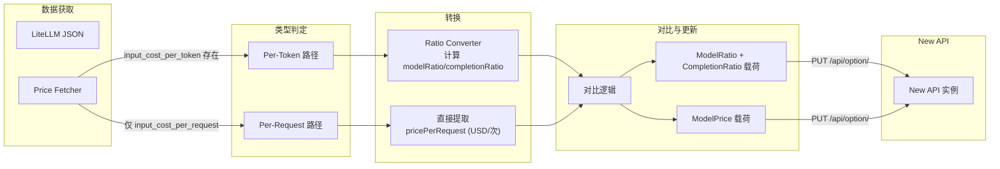

# 设计文档：按次计费模型支持

## 概述

本设计扩展现有的 New API 模型价格同步工具，使其支持按次计费（per-request）模型。当前系统仅处理按 token 计费模型（通过 `input_cost_per_token` / `output_cost_per_token`），而 LiteLLM 数据源中存在一类通过 `input_cost_per_request` / `output_cost_per_request` 定价的模型。这些模型在 New API 中通过 `ModelPrice` 选项（而非 `ModelRatio`/`CompletionRatio`）进行配置。

### 核心设计决策

1. **类型扩展而非重写**：在现有 `ModelPrice`、`RatioResult`、`ComparisonRow` 等接口上新增可选字段，保持向后兼容
2. **计费类型判定优先级**：当 LiteLLM 条目同时包含 `input_cost_per_token` 和 `input_cost_per_request` 时，优先使用 per-token 归类（因为 per-token 更精确）
3. **分离更新载荷**：per-token 模型更新 `ModelRatio`/`CompletionRatio`，per-request 模型更新 `ModelPrice`，两者独立生成载荷
4. **全量替换策略**：`ModelPrice` 更新采用与 `ModelRatio` 相同的全量替换逻辑，需保留未选中模型的现有价格

## 架构

本功能不改变整体架构，仅在现有数据流中增加按次计费模型的处理分支：



### 数据流变化

现有流程中，所有模型统一经过 `parseLiteLLMEntry` → `convert` → `compareRatios` → `buildUpdatePayload`。扩展后：

1. `parseLiteLLMEntry` 增加 per-request 模型识别，输出带 `pricingType` 的 `ModelPrice`
2. `convert` 对 per-request 模型跳过倍率计算，直接输出 `pricePerRequest`
3. `compareRatios` 对 per-request 模型基于价格（而非倍率）计算差异
4. `buildUpdatePayload` 分别生成 `ModelRatio`/`CompletionRatio` 和 `ModelPrice` 两组载荷

## 组件与接口

### 后端变更

#### 1. Price Fetcher (`priceFetcher.ts`)

`parseLiteLLMEntry` 函数需要扩展以识别 per-request 模型：

```typescript
export function parseLiteLLMEntry(
  key: string,
  entry: LiteLLMPriceEntry,
): ModelPrice | null {
  // 现有逻辑：检查 mode 是否为 chat/completion
  // ...

  const provider = resolveProvider(key, entry);
  if (!provider) return null;

  // 优先检查 per-token 字段
  if (
    typeof entry.input_cost_per_token === 'number' &&
    typeof entry.output_cost_per_token === 'number' &&
    entry.input_cost_per_token > 0 &&
    entry.output_cost_per_token > 0
  ) {
    return {
      modelId: key,
      modelName: key,
      provider,
      pricingType: 'per_token',
      inputPricePerMillion: entry.input_cost_per_token * 1_000_000,
      outputPricePerMillion: entry.output_cost_per_token * 1_000_000,
    };
  }

  // 其次检查 per-request 字段
  if (
    typeof entry.input_cost_per_request === 'number' &&
    entry.input_cost_per_request > 0
  ) {
    const outputCost = typeof entry.output_cost_per_request === 'number'
      ? entry.output_cost_per_request
      : 0;
    return {
      modelId: key,
      modelName: key,
      provider,
      pricingType: 'per_request',
      inputPricePerMillion: 0,
      outputPricePerMillion: 0,
      pricePerRequest: entry.input_cost_per_request + outputCost,
    };
  }

  return null;
}
```

#### 2. Ratio Converter (`ratioConverter.ts`)

新增 per-request 模型处理逻辑：

```typescript
export function convert(price: ModelPrice, provider?: string): RatioResult {
  if (price.pricingType === 'per_request') {
    return {
      modelId: price.modelId,
      provider,
      modelRatio: 0,
      completionRatio: 0,
      pricingType: 'per_request',
      pricePerRequest: price.pricePerRequest ?? 0,
    };
  }

  // 现有 per-token 逻辑不变
  const modelRatio = roundTo6(price.inputPricePerMillion / BASE_INPUT_PRICE);
  const completionRatio = roundTo6(price.outputPricePerMillion / price.inputPricePerMillion);
  return { modelId: price.modelId, provider, modelRatio, completionRatio, pricingType: 'per_token' };
}
```

#### 3. SQLite Store (`sqliteStore.ts`)

更新日志需要支持记录 per-request 模型的价格变化。`UpdateLogModelDetail` 接口扩展即可，无需新增数据库表。

### 前端变更

#### 4. 对比逻辑 (`comparison.ts`)

`compareRatios` 函数需要处理 per-request 模型的对比：

```typescript
// 对于 per-request 模型，基于 pricePerRequest 计算差异
if (upstreamEntry?.pricingType === 'per_request') {
  const currentPrice = currentModelPrice?.[modelId]; // 从 RatioConfig.modelPrice 获取
  const newPrice = upstreamEntry.pricePerRequest;
  const diffPercent = currentPrice && currentPrice !== 0
    ? ((newPrice - currentPrice) / currentPrice) * 100
    : undefined;
  // 构建 ComparisonRow，使用 currentPrice/newPrice 字段
}
```

#### 5. 更新载荷构建 (`updatePayload.ts`)

`buildUpdatePayload` 需要分离两种载荷：

```typescript
export function buildUpdatePayload(
  currentConfig: RatioConfig,
  selectedRows: ComparisonRow[],
): OptionUpdateRequest[] {
  const tokenRows = selectedRows.filter(r => r.pricingType !== 'per_request');
  const requestRows = selectedRows.filter(r => r.pricingType === 'per_request');

  const payloads: OptionUpdateRequest[] = [];

  // Per-token 载荷（现有逻辑）
  if (tokenRows.length > 0 || Object.keys(currentConfig.modelRatio).length > 0) {
    // ... 现有 ModelRatio/CompletionRatio 合并逻辑
    payloads.push(
      { key: 'ModelRatio', value: JSON.stringify(mergedModelRatio) },
      { key: 'CompletionRatio', value: JSON.stringify(mergedCompletionRatio) },
    );
  }

  // Per-request 载荷
  if (requestRows.length > 0 || Object.keys(currentConfig.modelPrice ?? {}).length > 0) {
    const mergedModelPrice = { ...(currentConfig.modelPrice ?? {}) };
    for (const row of requestRows) {
      if (row.newPrice !== undefined) {
        mergedModelPrice[row.modelId] = row.newPrice;
      }
    }
    payloads.push({ key: 'ModelPrice', value: JSON.stringify(mergedModelPrice) });
  }

  return payloads;
}
```

#### 6. 对比展示 (`ComparisonUpdate.tsx`)

- 新增"计费类型"标签列，使用 `Tag` 组件区分"按 Token"和"按次"
- Per-request 模型行显示"当前价格"和"新价格"列（USD/次），隐藏模型倍率和补全倍率列
- 补全倍率列对 per-request 模型显示"不适用"

#### 7. 当前倍率页面 (`CurrentRatios.tsx`)

- 新增 per-request 模型展示区域，显示模型名称和模型价格（USD/次）
- 使用标签标注计费类型

#### 8. 价格历史页面 (`PriceHistory.tsx`)

- 区分展示 per-token 和 per-request 模型的价格变化
- Per-request 模型显示"旧价格 → 新价格"（USD/次）

## 数据模型

### 类型扩展

#### `PricingType` 枚举

```typescript
export type PricingType = 'per_token' | 'per_request';
```

#### `ModelPrice` 接口扩展

```typescript
export interface ModelPrice {
  modelId: string;
  modelName: string;
  provider: string;
  pricingType?: PricingType;           // 新增，默认 'per_token'
  inputPricePerMillion: number;
  outputPricePerMillion: number;
  pricePerRequest?: number;            // 新增，仅 per_request 模型使用（USD/次）
}
```

#### `RatioResult` 接口扩展

```typescript
export interface RatioResult {
  modelId: string;
  provider?: string;
  modelRatio: number;
  completionRatio: number;
  pricingType?: PricingType;           // 新增
  pricePerRequest?: number;            // 新增，仅 per_request 模型使用
}
```

#### `RatioConfig` 接口扩展

```typescript
export interface RatioConfig {
  modelRatio: Record<string, number>;
  completionRatio: Record<string, number>;
  modelPrice?: Record<string, number>; // 新增，按次计费模型价格映射
}
```

#### `ComparisonRow` 接口扩展

```typescript
export interface ComparisonRow {
  // ... 现有字段
  pricingType?: PricingType;           // 新增
  currentPrice?: number;               // 新增，当前模型价格（USD/次）
  newPrice?: number;                   // 新增，新模型价格（USD/次）
}
```

#### `UpdateLogModelDetail` 接口扩展

```typescript
export interface UpdateLogModelDetail {
  modelId: string;
  pricingType?: PricingType;           // 新增
  oldModelRatio: number;
  newModelRatio: number;
  oldCompletionRatio: number;
  newCompletionRatio: number;
  oldPrice?: number;                   // 新增，旧模型价格（USD/次）
  newPrice?: number;                   // 新增，新模型价格（USD/次）
}
```

#### `LiteLLMPriceEntry` 接口扩展

```typescript
export interface LiteLLMPriceEntry {
  // ... 现有字段
  input_cost_per_request?: number;     // 新增
  output_cost_per_request?: number;    // 新增
}
```

### New API `ModelPrice` 配置格式

通过 `PUT /api/option/` 接口更新：

```typescript
// key: "ModelPrice"
// value: JSON 字符串
// 格式：{ "模型名": 价格(USD/次) }
// 示例：{ "gemini-3.1-flash-image-preview": 0.1 }
```

从 `/api/ratio_config` 获取时，`model_price` 字段包含当前配置：

```json
{
  "model_ratio": { "gpt-4o": 2.5 },
  "completion_ratio": { "gpt-4o": 3 },
  "model_price": { "gemini-3.1-flash-image-preview": 0.1 }
}
```


## 正确性属性

*正确性属性是一种在系统所有有效执行中都应成立的特征或行为——本质上是关于系统应该做什么的形式化陈述。属性是人类可读规范与机器可验证正确性保证之间的桥梁。*

### Property 1: 按次计费模型正确分类

*For any* 有效的 LiteLLM 条目，若该条目包含有效的 `input_cost_per_request`（正数）且不包含有效的 `input_cost_per_token`（正数），则 `parseLiteLLMEntry` 应返回一个 `pricingType` 为 `'per_request'` 的 `ModelPrice`，且 `pricePerRequest` 为正数。

**Validates: Requirements 1.1, 1.2, 1.4**

### Property 2: 按 token 计费优先级

*For any* 有效的 LiteLLM 条目，若该条目同时包含有效的 `input_cost_per_token`（正数）和 `input_cost_per_request`（正数），则 `parseLiteLLMEntry` 应返回一个 `pricingType` 为 `'per_token'` 的 `ModelPrice`，且 `inputPricePerMillion` 基于 `input_cost_per_token` 计算。

**Validates: Requirements 1.3**

### Property 3: 按次计费模型转换结果

*For any* `pricingType` 为 `'per_request'` 的 `ModelPrice`，`convert` 函数应返回 `modelRatio = 0`、`completionRatio = 0`、`pricingType = 'per_request'`，且 `pricePerRequest` 等于输入的 `pricePerRequest` 值。

**Validates: Requirements 3.1, 3.2, 3.4**

### Property 4: 按次计费模型差异百分比计算

*For any* 按次计费模型的对比行（同时拥有 `currentPrice` 和 `newPrice`，且 `currentPrice > 0`），差异百分比应等于 `(newPrice - currentPrice) / currentPrice × 100`。

**Validates: Requirements 4.3**

### Property 5: 混合计费类型载荷分离

*For any* 包含至少一个 per-token 和至少一个 per-request 模型的选中行集合，`buildUpdatePayload` 应生成的载荷中同时包含 `ModelRatio`/`CompletionRatio` 键（用于 per-token 模型）和 `ModelPrice` 键（用于 per-request 模型），且 per-request 模型不出现在 `ModelRatio` 载荷中，per-token 模型不出现在 `ModelPrice` 载荷中。

**Validates: Requirements 5.1, 5.2, 5.3**

### Property 6: 未选中按次计费模型价格保留

*For any* 当前 `modelPrice` 配置和选中更新的 per-request 模型子集，生成的 `ModelPrice` 载荷应满足：未选中的模型保持原价格不变，选中的模型更新为新价格，且所有原有模型均包含在载荷中。

**Validates: Requirements 5.4**

### Property 7: 按次计费模型价格历史存取往返一致性

*For any* 包含 `pricingType = 'per_request'` 和有效 `pricePerRequest` 的 `ModelPrice` 数组，保存为 `PriceHistoryEntry` 到 SQLite_Store 后再读取，得到的每个模型的 `pricingType` 和 `pricePerRequest` 应与原始值相等。

**Validates: Requirements 7.1**

### Property 8: 按次计费模型更新日志存取往返一致性

*For any* 包含 `pricingType = 'per_request'`、`oldPrice` 和 `newPrice` 的 `UpdateLogModelDetail` 数组，保存为 `UpdateLogEntry` 到 SQLite_Store 后再读取，得到的每个模型的 `pricingType`、`oldPrice` 和 `newPrice` 应与原始值相等。

**Validates: Requirements 7.3**

## 错误处理

### 数据解析错误

| 场景 | 处理方式 |
|------|----------|
| `input_cost_per_request` 为非正数或非数字 | 跳过该条目，不将其识别为 per-request 模型 |
| `output_cost_per_request` 缺失 | 将 output cost 视为 0，仅使用 `input_cost_per_request` 作为总价格 |
| `model_price` 字段 JSON 解析失败 | 将 `modelPrice` 设为空对象 `{}`，记录警告日志 |
| `model_price` 中的价格值为非数字 | 跳过该模型条目，记录警告日志 |

### 更新错误

| 场景 | 处理方式 |
|------|----------|
| `PUT /api/option/` 更新 `ModelPrice` 失败 | 独立于 `ModelRatio`/`CompletionRatio` 的更新结果报告，显示具体错误信息 |
| 部分 per-request 模型更新失败 | 由于 `ModelPrice` 是全量替换，要么全部成功要么全部失败，提供重试按钮 |
| 当前 `modelPrice` 获取失败导致无法合并 | 提示用户"无法获取当前按次计费价格配置，更新可能覆盖现有配置"，要求用户确认 |

## 测试策略

### 测试框架

- **单元测试**：Vitest
- **属性测试**：fast-check
- **组件测试**：React Testing Library + Vitest

### 属性测试

每个正确性属性对应一个属性测试，使用 fast-check 生成随机输入，最少运行 100 次迭代。

每个测试需标注对应的设计属性：

```typescript
// Feature: per-request-pricing, Property 1: 按次计费模型正确分类
test.prop([perRequestLiteLLMEntryArb], (entry) => {
  const result = parseLiteLLMEntry(entry.key, entry.value);
  expect(result).not.toBeNull();
  expect(result!.pricingType).toBe('per_request');
  expect(result!.pricePerRequest).toBeGreaterThan(0);
});
```

### 单元测试

单元测试聚焦于：
- 边界情况：`input_cost_per_request = 0`、极大值、`output_cost_per_request` 缺失
- 向后兼容：无 `pricingType` 字段的旧数据默认为 `per_token`
- 混合场景：同时包含 per-token 和 per-request 模型的对比和更新
- UI 渲染：per-request 模型行的列显示逻辑

### 测试覆盖重点

| 模块 | 单元测试 | 属性测试 |
|------|----------|----------|
| Price Fetcher (per-request 解析) | 缺失字段、非正数、同时存在两种字段 | Property 1, 2 |
| Ratio Converter (per-request 转换) | 零价格、极大价格 | Property 3 |
| Comparison Logic (per-request 对比) | 当前价格为 0、新模型、已移除模型 | Property 4 |
| Update Payload (载荷分离) | 仅 per-token、仅 per-request、混合 | Property 5, 6 |
| SQLite Store (per-request 持久化) | 空数组、大量模型 | Property 7, 8 |
